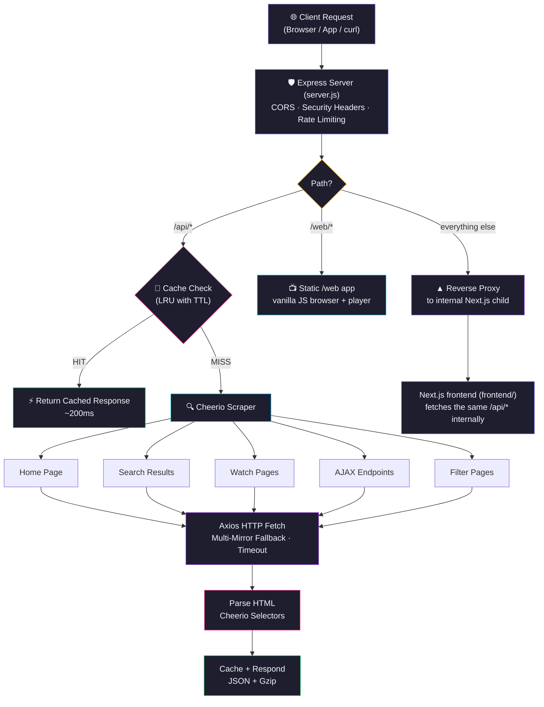
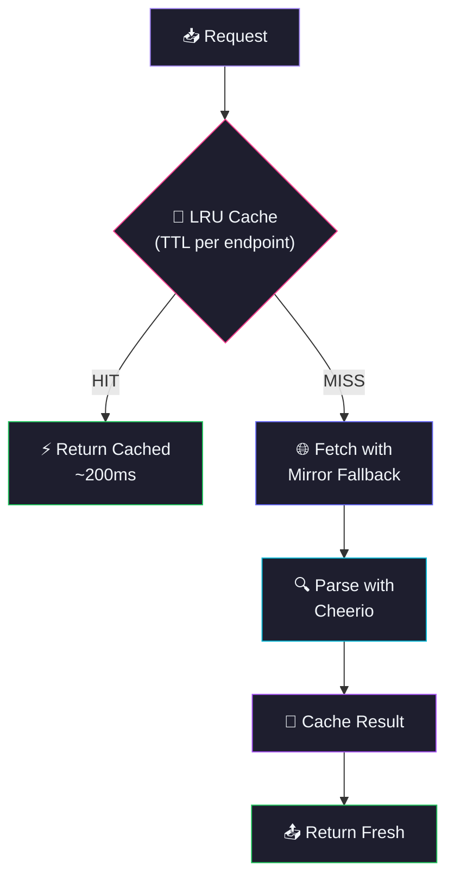

<h1 align="center">AniKoto</h1>

<p align="center">
  <b>A RESTful anime data API, a full browsing website, and a standalone video player — all served from one process.</b><br/>
  Search, browse, filter, watch — every endpoint returns live data scraped from anikototv.to with smart caching and multi-mirror fallback.<br/>
  Built for building anime websites, apps, and bots, or used directly as a full anime-watching site out of the box.
</p>

<p align="center">
  <a href="#-table-of-contents">Table of Contents</a> &bull;
  <a href="#-features">Features</a> &bull;
  <a href="#-api-endpoints">API Docs</a> &bull;
  <a href="#-quick-start">Quick Start</a> &bull;
  <a href="#-deployment">Deployment</a> &bull;
  <a href="#-contributing">Contributing</a>
</p>

---

> [!WARNING]
> 1. This `API` does not store any files — it only links to media hosted on 3rd party services.
> 2. This `API` is explicitly made for **educational purposes only** and not for commercial usage. This repo will not be responsible for any misuse of it.
> 3. All anime data, images, and content belong to their respective owners. This project is not affiliated with anikototv.to.

---

## 📖 Table of Contents

- [Overview](#-overview)
- [Features](#-features)
- [Anime Data Source](#-anime-data-source)
- [Tech Stack](#-tech-stack)
- [Architecture](#-architecture)
- [Frontend & Web Player](#-frontend--web-player)
- [Project Structure](#-project-structure)
- [Quick Start](#-quick-start)
- [Configuration](#-configuration)
- [API Endpoints](#-api-endpoints)
- [API Response Schema](#-api-response-schema)
- [Deployment](#-deployment)
- [Available Scripts](#-available-scripts)
- [Performance](#-performance)
- [Changelog Highlights](#-changelog-highlights)
- [Troubleshooting](#-troubleshooting)
- [FAQ](#-faq)
- [Roadmap](#-roadmap)
- [Contributing](#-contributing)
- [Acknowledgements](#-acknowledgements)
- [License](#-license)
- [Author](#-author)
- [Star History](#-star-history)

---

## 🌸 Overview

**AniKotoAPI** is three things running out of one Node process on one port:

1. A REST API (`/api/*`) that scrapes and serves real-time information from **anikototv.to** — anime details, episode lists, streaming servers, search, filtering, rankings, and more — with zero database setup.
2. A full Next.js browsing website (everything under `/`), spawned internally by the API server and reverse-proxied through it.
3. A self-contained, dependency-free vanilla JS/HTML/CSS anime browsing + video player app at `/web`, with its own search, watch history, and a custom HLS player.

You can use just the API in your own app/bot, or run the whole thing and get a working anime site out of the box.

> [!TIP]
> No Database, No Auth, No Complex Setup. `npm start` and you have a production API *and* a working website.

### Why AniKotoAPI?

- 🎬 **43 Endpoints** — Complete coverage of anikototv.to data
- 🌐 **Full Website Included** — Not just an API: a Next.js frontend and a standalone `/web` player ship in the same repo, on the same port
- 🔍 **Full-Text Search** — Search anime by keyword with suggestions
- 📺 **Episode Lists** — AJAX-loaded episode data with server info
- 🎯 **Smart Filtering** — Genre, type, status, rating, sort, season, year
- 🏆 **Rankings** — Top 10 (day/week/month), trending, most popular
- 🎲 **Random Anime** — Random anime discovery endpoint
- ⚡ **Smart Caching** — LRU cache with configurable TTL per endpoint
- 🌐 **Multi-Mirror Fallback** — Automatic failover across 5 mirror domains
- 🛡️ **Content-Verified Stream Proxy** — Video segments are verified by byte signature, not just domain, so legitimate CDNs aren't mistaken for ads
- 🚀 **Response Compression** — Gzip compression for faster responses
- 📊 **Live Data** — Every response is fresh from the actual website

### How It Works

One Express process on one port routes every request three ways: API calls are served directly, everything else is handed to an internally-spawned Next.js frontend, and `/web` serves a separate static single-page app.



---

## ✨ Features

<table>
  <tr>
    <td>

### ⚡ Core
- **Real-time scraping** from anikototv.to
- **Smart caching** with LRU and configurable TTL per endpoint
- **43 RESTful endpoints** covering all data
- **AJAX episode loading** for accurate data
- **Mapper API integration** for extra servers
- **Graceful error handling** per endpoint

    </td>
    <td>

### 🔍 Data
- **Keyword search** with pagination (`/api/search`)
- **Search suggestions** for autocomplete (`/api/search/suggest`)
- **Advanced filtering** — genre, type, status, rating, sort, season, year
- **AZ List** alphabetical browsing (`/api/az-list/:letter`)
- **Random anime** discovery (`/api/random`)
- **Top 10 rankings** day/week/month (`/api/top-ten`)

    </td>
  </tr>
  <tr>
    <td>

### 📺 Streaming
- **Watch page** — full episode data with servers
- **Stream info** — video embed URLs via AJAX
- **Stream URL Resolution** — resolve embed URLs to actual m3u8/mp4
- **Server list** — all available streaming servers with normalized names
- **Mapper API** — gogoanime/anivibe server sources
- **Episode navigation** — prev/next episode data
- **Next episode schedule** — countdown timer data
- **M3U8 Proxy** — CORS-free HLS playlist proxy with URL rewriting
- **TS Proxy** — CORS-free video segment proxy

    </td>
    <td>

### 🛡️ Reliability
- **CORS enabled** — works from any frontend
- **Error responses** with descriptive messages
- **Input validation** — required params checked
- **Timeout protection** — Configurable per request
- **Multiple domains** — fallback mirror support
- **Zero dependencies on databases** — pure scraping

    </td>
  </tr>
  <tr>
    <td>

### 🌐 Website & Player
- **Full Next.js frontend** — spawned internally, reverse-proxied at `/`
- **Standalone `/web` app** — vanilla JS/HTML/CSS, no build step, no framework
- **Custom HLS video player** — quality selector, skip intro/outro, keyboard shortcuts
- **Watch history & continue watching** — tracked locally per browser
- **Raw endpoint tester** at `/web/api-tester`

    </td>
    <td>

### 🛡️ Security
- **Content-verified stream proxy** — segments checked by byte signature, not just domain
- **DNS-resolved SSRF guard** — blocks private/internal/metadata addresses before any proxied fetch
- **CSP, HSTS, X-Frame-Options** and other security headers on every response
- **Configurable rate limiting** — per-IP, sliding window
- **Request body size limits** to prevent large-payload abuse

    </td>
  </tr>
</table>

### 🌟 Feature Highlights

| Feature | Description | Status |
|:---|:---|:---:|
| 🎬 43 API Endpoints | Complete coverage of anime data | ✅ |
| 🌐 Full Website | Next.js frontend + standalone `/web` player, one port | ✅ |
| 🔍 Full-Text Search | Keyword search with pagination | ✅ |
| 📺 Episode Lists | AJAX-loaded episode data | ✅ |
| 🎯 Advanced Filtering | Genre, type, status, rating, sort, season | ✅ |
| 🏆 Top 10 Rankings | Day/week/month leaderboards | ✅ |
| 🎲 Random Anime | Random anime discovery | ✅ |
| 📡 Streaming Servers | Video embed URLs + mapper API | ✅ |
| 🔗 Stream URL Resolution | Resolve embed URLs to m3u8/mp4 | ✅ |
| 📋 AZ List | A-Z alphabetical browsing | ✅ |
| 🔄 Smart Caching | LRU cache with configurable TTL | ✅ |
| 🌐 M3U8 Proxy | Content-verified HLS proxy with URL rewriting | ✅ |
| 🏗️ Single-Process Deploy | `npm start` runs API + website together | ✅ |
| 📖 Full JSDoc Docs | Complete documentation coverage | ✅ |

---

## 🗞️ Anime Data Source

| Source | Domain | Status | Data |
|:---|:---|:---|:---|
| **AniKoto** | `anikototv.to` | ✅ Active | Primary source |
| **AniKoto** | `anikoto.cz` | ✅ Active | Mirror domain |
| **AniKoto** | `anikoto.me` | ✅ Active | Mirror domain |
| **AniKoto** | `anikoto.net` | ✅ Active | Mirror domain |
| **AniKoto** | `anikototv.se` | ✅ Active | Mirror domain |

### Data Available

| Category | Count | Source |
|:---|:---|:---|
| 🎬 Total Anime | 10,000+ | anikototv.to |
| 📺 Total Episodes | 100,000+ | AJAX endpoints |
| 🏷️ Genres | 43 | Genre pages |
| 🎭 Types | 6 | TV, Movie, OVA, ONA, Special, Music |
| 📊 Statuses | 3 | Airing, Finished, Not Yet Aired |

---

## 🛠️ Tech Stack

**Backend / API** (`package.json`)

| Technology | Purpose | Version | Documentation |
|:---|:---|:---|:---|
| 🟢 [Node.js](https://nodejs.org/) | JavaScript runtime | >= 20 | [Docs](https://nodejs.org/docs/) |
| ⚡ [Express](https://expressjs.com/) | HTTP server framework | 4.21 | [Docs](https://expressjs.com/en/4x/api.html) |
| 🔍 [Cheerio](https://cheerio.js.org/) | HTML parsing & scraping | 1.0 | [Docs](https://cheerio.js.org/docs/) |
| 🌐 [Axios](https://axios-http.com/) | HTTP client for scraping | 1.8 | [Docs](https://axios-http.com/docs/intro) |
| 🔀 [http-proxy-middleware](https://github.com/chimurai/http-proxy-middleware) | Reverse-proxies non-API traffic to the Next.js frontend | 4.2 | [Docs](https://github.com/chimurai/http-proxy-middleware) |
| 🗜️ [compression](https://github.com/expressjs/compression) | Gzip response compression | 1.8 | [Docs](https://github.com/expressjs/compression) |
| 🔧 [dotenv](https://github.com/motdotla/dotenv) | Environment variables | 16.4 | [Docs](https://github.com/motdotla/dotenv) |

**Frontend** (`frontend/package.json` — spawned internally by `server.js`, see [Architecture](#-architecture))

| Technology | Purpose | Version |
|:---|:---|:---|
| ▲ [Next.js](https://nextjs.org/) | App Router frontend framework | 15.5 |
| ⚛️ [React](https://react.dev/) | UI library | 19.1 |
| 🎨 [Tailwind CSS](https://tailwindcss.com/) | Utility-first styling | v4 |
| 🔷 [TypeScript](https://www.typescriptlang.org/) | Static typing | 5.x |

**`/web` player** (`public/web/`) — no framework, no build step: plain HTML/CSS/JS plus [hls.js](https://github.com/video-dev/hls.js/) for HLS playback in the browser.

### 📦 Key Backend Dependencies

```json
{
  "express": "^4.21.0",              // HTTP server
  "axios": "^1.8.0",                 // HTTP client for scraping
  "cheerio": "^1.0.0-rc.12",         // HTML parsing
  "compression": "^1.8.1",           // Response compression
  "http-proxy-middleware": "^4.2.0", // Reverse proxy to the Next.js frontend
  "dotenv": "^16.4.0"                // Environment variables
}
```

---

## 🏗️ Architecture

`server.js` is the single entry point for everything. On startup it:
1. Registers all `/api/*` routes directly (see [Request Flow](#request-flow) below).
2. If `frontend/` exists, spawns it as a child process (`npm run dev` or `npm run start` depending on `NODE_ENV`) on an internal-only port (`NEXT_INTERNAL_PORT`, default `4001`), then reverse-proxies every other request to it via `http-proxy-middleware`.
3. Serves the standalone `/web` app straight from `public/web/` via `express.static`, with explicit `Cache-Control: no-cache` on its HTML so fixes there are never stuck behind a stale cached copy.

If `frontend/` isn't present (e.g. a minimal API-only checkout), the server logs a notice and runs in API-only mode automatically — no config needed either way.

### Request Flow

| Stage | Component | Description |
|:-----:|-----------|-------------|
| 1 | **Client** | Browser, app, or `curl` sends request |
| 2 | **Express (`server.js`)** | Routes by path, applies CORS + security headers + rate limiting |
| 3a | **`/api/*`** | Cache check (LRU, TTL per endpoint) → scrape on miss → JSON response |
| 3b | **`/web/*`** | Served statically from `public/web/` |
| 3c | **everything else** | Reverse-proxied to the internally-spawned Next.js frontend |
| 4 | **Scrape Source** *(API path only)* | Axios fetches HTML from anikototv.to with multi-mirror fallback |
| 5 | **Parse HTML** *(API path only)* | Cheerio extracts data using CSS selectors |
| 6 | **Cache + Respond** *(API path only)* | Store in cache, return JSON response |

### Caching Architecture



> [!TIP]
> The cache is an in-memory LRU with configurable TTL per endpoint type, living for the lifetime of the Node process. Running as a standalone/Docker/Render process (the recommended model — see [Deployment](#-deployment)) means it persists across requests indefinitely; on Vercel's serverless functions it only survives across warm invocations of the same instance, and the frontend/`/web` spawn model isn't compatible with serverless at all (see the Vercel note in Deployment).

---

## 🌐 Frontend & Web Player

Two separate UIs ship alongside the API, both reachable through the same port `server.js` listens on:

| Surface | Route | What it is |
|:---|:---|:---|
| **Next.js frontend** | `/` (everything not `/api/*` or `/web/*`) | A full Next.js 15 App Router site — home, discover, search, anime detail, watch pages, schedule. Runs as a separate internal process (`frontend/`), spawned by `server.js` and reverse-proxied transparently; server-rendered pages fetch the same `/api/*` endpoints internally via `API_INTERNAL_BASE`. |
| **`/web` player** | `/web` | A single self-contained HTML file (`public/web/index.html`, no build step, no framework) with its own search, browsing, anime detail, a custom HLS video player (quality switching, skip intro/outro, keyboard shortcuts), and locally-tracked watch history/continue-watching. |
| **API tester** | `/web/api-tester` | A raw endpoint tester for hitting any `/api/*` route directly from the browser, useful when developing against this API. |

Both UIs are optional from the API's point of view — you can ignore them entirely and just call `/api/*` from your own app, or run the repo as-is and get a working anime site immediately.

---

## 📁 Project Structure

```
AniKotoAPI/
├── 📂 frontend/                          # ▲ Next.js website (spawned internally, see Architecture)
│   ├── 📂 src/                           #    App Router pages, components, lib
│   └── 📄 package.json                   #    Its own deps — Next.js 15, React 19, Tailwind v4
│
├── 📂 public/                            # 🌐 Static files served directly by Express
│   ├── 📄 index.html                     #    📖 Landing page
│   ├── 📄 404.html                       #    ❌ Custom 404 error page
│   ├── 📄 tos.html                       #    📋 Terms of Service (served at /tos)
│   ├── 📄 privacy.html                   #    🔒 Privacy Policy (served at /privacy)
│   ├── 📄 manifest.json                  #    📱 PWA manifest
│   ├── 📄 robots.txt                     #    🤖 Crawler directives
│   ├── 📄 sitemap.xml                    #    🗺️ Sitemap
│   │
│   └── 📂 web/                           #    📺 Standalone browsing + player app (see Frontend & Web Player)
│       ├── 📄 index.html                 #       The whole app — no build step, no framework
│       ├── 📂 api-tester/                #       Raw endpoint tester at /web/api-tester
│       └── 📂 vendor/                    #       Self-hosted fonts + hls.js
│
├── 📂 docs/                               # 📚 API documentation
│   ├── 📄 index.md                       #    Overview, quick start
│   ├── 📄 endpoints.md                   #    Full API reference (43 endpoints)
│   ├── 📄 streaming.md                   #    Streaming flow guide + proxy security model
│   ├── 📄 examples.md                    #    Code examples (cURL, JS, Python)
│   ├── 📄 architecture.md                #    Project structure, tech stack
│   └── 📄 testing.md                     #    Integration test suite & benchmarks
│
├── 📂 src/                               # ⚙️ API core logic
│   ├── 📂 configs/                       #    🔧 Configuration files
│   │   ├── 📄 dataUrl.js                 #       🌐 URL patterns for anikototv.to
│   │   ├── 📄 header.config.js           #       📋 Request headers
│   │   ├── 📄 ids.config.js              #       🏷️ Genre/Type/Status/Source/Season ID mappings
│   │   └── 📄 streamProxy.config.js      #       🛡️ Stream domain allowlist + SSRF/content-signature guards
│   │
│   ├── 📂 controllers/                   #    🎮 Route handlers (27 files)
│   │   ├── 📄 homeInfo.controller.js
│   │   ├── 📄 animeInfo.controller.js
│   │   ├── 📄 search.controller.js
│   │   ├── 📄 episodeList.controller.js
│   │   ├── 📄 episodeListAjax.controller.js
│   │   ├── 📄 streamInfo.controller.js
│   │   ├── 📄 streamResolver.controller.js  # Stream URL resolution + quality detection
│   │   ├── 📄 filter.controller.js
│   │   ├── 📄 watchPage.controller.js
│   │   └── 📄 ... (18 more)
│   │
│   ├── 📂 extractors/                    #    🔍 HTML scrapers (27 files)
│   │   ├── 📄 homeInfo.extractor.js      #       🏠 Home page data
│   │   ├── 📄 search.extractor.js        #       🔍 Search results
│   │   ├── 📄 animeInfo.extractor.js     #       📺 Anime details
│   │   ├── 📄 streamInfo.extractor.js    #       📡 Streaming servers
│   │   ├── 📄 streamResolver.extractor.js #      🔗 Stream URL resolution, M3U8 parser
│   │   ├── 📄 filter.extractor.js        #       🎯 Filtered results
│   │   ├── 📄 watchPage.extractor.js     #       ▶️ Watch page data
│   │   ├── 📄 seasons.extractor.js       #       📅 Season info from watch page
│   │   ├── 📄 watchOrder.extractor.js    #       📋 Watch order from sidebar
│   │   ├── 📄 episodeList.extractor.js   #       📋 Episode lists
│   │   └── 📄 ... (17 more)
│   │
│   ├── 📂 helper/                        #    🛠️ Utility functions
│   │   ├── 📄 cache.helper.js            #       💾 In-memory LRU caching
│   │   ├── 📄 countPages.helper.js       #       📄 Pagination counter
│   │   ├── 📄 extractPages.helper.js     #       📃 Page fetcher
│   │   ├── 📄 mirror.helper.js           #       🌐 Multi-mirror fallback (5 domains)
│   │   ├── 📄 parseListItem.helper.js    #       📋 Shared list item parser
│   │   ├── 📄 pagination.helper.js       #       📊 Pagination metadata generator
│   │   ├── 📄 slug.helper.js             #       🔗 Slug extraction from hrefs
│   │   └── 📄 streamSegmentGuard.helper.js # 🛡️ Content-signature validation for stream segments
│   │
│   └── 📂 routes/                        #    🛤️ Express routes
│       ├── 📄 apiRoutes.js               #       🌐 Main API routes + M3U8/TS proxy
│       └── 📄 category.route.js          #       🏷️ Genre/type/status category routes
│
├── 📄 server.js                          # 🚀 Entry point — API + frontend spawn + /web static serving
├── 📄 package.json                       # 📦 Backend dependencies & scripts
├── 📄 Dockerfile                         # 🐳 Builds backend + frontend together
├── 📄 render.yaml                        # 🖥️ Render deployment config
├── 📄 vercel.json                        # ▲ Vercel config — API-only, see Deployment
├── 📄 CHANGELOG.md                       # 📝 Version history
├── 📄 LICENSE                            # 📜 MIT License
└── 📄 README.md                          # 📖 This file
```

---

## 🚀 Quick Start

### Prerequisites

| Requirement | Minimum | Recommended |
|:---|:---|:---|
| 📦 Node.js | 20.x | 20.x LTS |
| 📦 npm | 9.0+ | 10.x |
| 💻 OS | Windows, macOS, Linux | Any |

### 🔧 Installation

```bash
# 1️⃣ Clone the repository
git clone https://github.com/Shineii86/AniKotoAPI.git
cd AniKotoAPI

# 2️⃣ Install backend dependencies
npm install

# 3️⃣ Install frontend dependencies (skip this if you only want the API — server.js
#    detects a missing frontend/ install and falls back to API-only automatically)
cd frontend && npm install && cd ..

# 4️⃣ Start development server (API + frontend + /web, all on one port)
npm run dev
```

> 🌐 Open [http://localhost:4444](http://localhost:4444) — the frontend home page. The API lives under `/api/*` and the standalone player under `/web`.

### 🏗️ Build for Production

```bash
# The frontend needs a production build before "npm start" can serve it —
# Dockerfile and render.yaml already do this for you; for a manual/VPS deploy:
cd frontend && npm run build && cd ..
npm start
```

### 🐳 Alternative Package Managers

```bash
# Using yarn
yarn install
yarn dev

# Using pnpm
pnpm install
pnpm dev

# Using bun
bun install
bun dev
```

---

## ⚙️ Configuration

### Environment Variables

| Variable | Default | Description |
|:---|:---|:---|
| `PORT` | `4444` | Server port (Express mode only) |
| `ALLOWED_ORIGINS` | `*` | Comma-separated allowed origins |
| `NODE_ENV` | — | Set to `production` to hide internal error details from API responses |
| `TRUST_PROXY` | `1` | Number of trusted reverse-proxy hops in front of the app (needed for accurate per-client rate limiting behind Vercel/Render) |
| `RATE_LIMIT` | `300` | Max requests per client per `RATE_WINDOW` |
| `RATE_WINDOW` | `60000` | Rate-limit window in milliseconds |
| `REQUEST_TIMEOUT` | `30000` | Per-request timeout in milliseconds |
| `CACHE_MAX_SIZE` | `200` | Max number of entries in the in-memory response cache |
| `CACHE_DEFAULT_TTL` | `300000` | Default cache entry lifetime in milliseconds |
| `MIRROR_DOMAINS` | *(built-in list)* | Comma-separated mirror domains to try, in priority order |
| `MIRROR_CACHE_TTL` | `3600000` | How long a discovered working mirror is cached, in milliseconds |
| `NEXT_INTERNAL_PORT` | `4001` | Internal-only port the spawned Next.js frontend listens on (never exposed directly — reached only through `server.js`'s reverse proxy) |
| `API_INTERNAL_BASE` | *(derived from `PORT`)* | Base URL the frontend's server-rendered pages use to call the API internally — set automatically by `server.js` when it spawns the frontend, no need to set it yourself |

### Vercel Configuration

> [!WARNING]
> `vercel.json` deploys **API-only**. It maps `server.js` to a `@vercel/node` serverless function and forwards all requests to it, but Vercel's serverless functions can't run the spawned Next.js frontend child process this project uses everywhere else — so on Vercel, only `/api/*` will actually work. For the full experience (API + frontend + `/web` player on one port), use [Docker, Render, or a standalone Node process](#-deployment) instead.

---

## 📡 API Endpoints

### Base URL
```
https://anikototvapi.vercel.app/api
```

### Streaming Flow

To get a stream URL, follow these 3 steps:

```bash
# Step 1: Get episodes by animeId (returns server_ids)
curl "https://anikototvapi.vercel.app/api/episodes/958"

# Step 2: Get servers (pass server_ids from Step 1)
curl "https://anikototvapi.vercel.app/api/servers?ids=dXNCT3hNQzk3THhSTW8ySnM5..."

# Step 3: Get stream URL (pass link_id from Step 2)
curl "https://anikototvapi.vercel.app/api/stream?id=MTF1dkFtaW9BRTZPbzJJRElFZUZr..."
```

### Stream URL Resolution

The `/api/stream` endpoint returns an embed URL. To get the actual video URL (m3u8/mp4):

```bash
# Resolve embed URL to actual stream URL
curl "https://anikototvapi.vercel.app/api/stream/resolve?id=MTF1dkFtaW9BRTZPbzJJRElFZUZr..."

# Get quality options from an M3U8 playlist
curl "https://anikototvapi.vercel.app/api/stream/qualities?url=https://example.com/playlist.m3u8"

# Proxy M3U8 playlist (rewrites URLs for CORS-free playback)
curl "https://anikototvapi.vercel.app/api/stream/proxy?url=https://example.com/playlist.m3u8"
```

### Dub & Sub Switch

Servers have a `type` field — use it to pick sub or dub:

```json
// Step 2 response
{
  "results": [
    { "type": "sub", "name": "HD-1", "link_id": "MTF1..." },
    { "type": "sub", "name": "Vidstream-2", "link_id": "MTF1..." },
    { "type": "dub", "name": "HD-1", "link_id": "MTF1..." },
    { "type": "dub", "name": "Vidstream-2", "link_id": "MTF1..." }
  ]
}
```

```javascript
// Pick dub or sub
const servers = await fetch('/api/servers?ids=...').then(r => r.json());
const dubServer = servers.results.find(s => s.type === 'dub');
const subServer = servers.results.find(s => s.type === 'sub');

// Get stream URL
const stream = await fetch(`/api/stream?id=${dubServer.link_id}`).then(r => r.json());
// stream.results.url = "https://megaplay.buzz/stream/s-5/169837/dub"
```

> **Note:** Not all anime have dub. Check `sub`/`dub` counts in search or home response.

---

> ## 🏠 GET Home Info

### Endpoint

```bash
/
```

#### Parameters

> No parameters required.

#### Example of request

```bash
curl "https://anikototvapi.vercel.app/api/"
```

```javascript
import axios from "axios";
const resp = await axios.get("https://anikototvapi.vercel.app/api/");
console.log(resp.data);
```

#### Sample Response

```json
{
  "success": true,
  "results": {
    "spotlights": [
      { "slug": "i-want-you-to-show-me-your-panties-with-a-disgusted-face-returns", "poster": "https://cdn.anipixcdn.co/background/0a53175c11a0c2c1_1780649103.webp", "title": "I Want You To Show Me Your Panties With a Disgusted Face Returns", "japaneseTitle": "Iya na Kao sare nagara Opantsu Misete Moraitai Returns", "description": "", "rating": "", "quality": "HD", "sub": 0, "dub": 0, "date": "Apr 30, 2026 to Jun 4, 2026" },
      { "slug": "wistoria-wand-and-sword-season-2-dua04", "poster": "https://cdn.anipixcdn.co/background/101f58336250ee0d_1779363645.webp", "title": "Wistoria: Wand and Sword Season 2", "japaneseTitle": "Tsue to Tsurugi no Wistoria Season 2", "rating": "PG-13", "quality": "HD", "date": "Apr 12, 2026 to ?" },
      { "slug": "one-piece-odmau", "poster": "https://image.tmdb.org/t/p/original/a6ptrTUH1c5OdWanjyYtAkOuYD0.jpg", "title": "One Piece", "japaneseTitle": "One Piece", "rating": "PG-13", "quality": "HD", "date": "Oct 20, 1999 to ?" }
    ],
    "trending": [
      { "slug": "digimon-beatbreak-u2o7s/ep-34", "poster": "https://cdn.anipixcdn.co/thumbnail/12d6b5e5a791029b893bf3f08733aec2.jpg", "title": "Digimon Beatbreak", "japaneseTitle": "Digimon Beatbreak", "sub": 34, "dub": 25, "total": 0, "type": "TV" },
      { "slug": "ghost-concert-missing-songs-ndxfn/ep-10", "poster": "https://cdn.anipixcdn.co/thumbnail/21c1f9ec2efafedf9e2bd429875471c0.jpg", "title": "Ghost Concert: Missing Songs", "sub": 10, "dub": 0, "total": 12, "type": "TV" },
      { "slug": "one-piece-odmau/ep-1165", "poster": "https://cdn.anipixcdn.co/thumbnail/f899139df5e1059396431415e770c6dd.jpg", "title": "One Piece", "sub": 1165, "dub": 1133, "total": 0, "type": "TV" }
    ],
    "topAiring": [
      { "slug": "i-want-you-to-show-me-your-panties-with-a-disgusted-face-returns", "poster": "https://cdn.anipixcdn.co/thumbnail/1dea34fcedb64cd270f5d2de28f485f1.jpg", "title": "I Want You To Show Me Your Panties With a Disgusted Face Returns", "sub": 6, "dub": 0, "type": "" },
      { "slug": "wistoria-wand-and-sword-season-2-dua04", "poster": "https://cdn.anipixcdn.co/thumbnail/4739d8dbd05dddb73604f6240b83ea68.jpg", "title": "Wistoria: Wand and Sword Season 2", "sub": 9, "dub": 7, "type": "" },
      { "slug": "one-piece-odmau", "poster": "https://cdn.anipixcdn.co/thumbnail/f899139df5e1059396431415e770c6dd.jpg", "title": "One Piece", "sub": 1165, "dub": 1133, "type": "" }
    ],
    "genres": ["Action","Adventure","Cars","Comedy","Dementia","Demons","Drama","Ecchi","Fantasy","Game","Harem","Historical","Horror","Isekai","Josei","Kids","Magic","Mahou Shoujo","Martial Arts","Mecha","Military","Music","Mystery","Parody","Police","Psychological","Romance","Samurai","School","Sci-Fi","Seinen","Shoujo","Shoujo Ai","Shounen","Shounen Ai","Slice of Life","Space","Sports","Super Power","Supernatural","Thriller","unknown","Vampire"]
  }
}
```

---

> ## 🔝 GET Top 10 Anime's Info

### Endpoint

```bash
/top-ten
```

#### Parameters

> No parameters required.

#### Example of request

```bash
curl "https://anikototvapi.vercel.app/api/top-ten"
```

```javascript
import axios from "axios";
const resp = await axios.get("https://anikototvapi.vercel.app/api/top-ten");
console.log(resp.data);
```

#### Sample Response

```json
{
  "success": true,
  "results": {
    "today": [
      { "slug": "i-want-you-to-show-me-your-panties-with-a-disgusted-face-returns", "rank": 1, "name": "I Want You To Show Me Your Panties With a Disgusted Face Returns", "poster": "https://cdn.anipixcdn.co/thumbnail/1dea34fcedb64cd270f5d2de28f485f1.jpg", "sub": 6, "dub": 0, "type": "" },
      { "slug": "wistoria-wand-and-sword-season-2-dua04", "rank": 2, "name": "Wistoria: Wand and Sword Season 2", "poster": "https://cdn.anipixcdn.co/thumbnail/4739d8dbd05dddb73604f6240b83ea68.jpg", "sub": 9, "dub": 7, "type": "" },
      { "slug": "one-piece-odmau", "rank": 3, "name": "One Piece", "poster": "https://cdn.anipixcdn.co/thumbnail/f899139df5e1059396431415e770c6dd.jpg", "sub": 1165, "dub": 1133, "type": "" }
    ],
    "week": [
      { "slug": "one-piece-odmau", "rank": 1, "name": "One Piece", "poster": "https://cdn.anipixcdn.co/thumbnail/f899139df5e1059396431415e770c6dd.jpg", "sub": 1165, "dub": 1133, "type": "" },
      { "slug": "i-want-you-to-show-me-your-panties-with-a-disgusted-face-returns", "rank": 2, "name": "I Want You To Show Me Your Panties With a Disgusted Face Returns", "sub": 6, "dub": 0, "type": "" },
      { "slug": "re-zero-starting-life-in-another-world-season-4-4hk9h", "rank": 3, "name": "Re:ZERO -Starting Life in Another World- Season 4", "sub": 9, "dub": 9, "type": "" }
    ],
    "month": [
      { "slug": "one-piece-odmau", "rank": 1, "name": "One Piece", "poster": "https://cdn.anipixcdn.co/thumbnail/f899139df5e1059396431415e770c6dd.jpg", "sub": 1165, "dub": 1133, "type": "" },
      { "slug": "that-time-i-got-reincarnated-as-a-slime-season-4-0u851", "rank": 2, "name": "That Time I Got Reincarnated as a Slime Season 4", "sub": 9, "dub": 7, "type": "" },
      { "slug": "wistoria-wand-and-sword-season-2-dua04", "rank": 3, "name": "Wistoria: Wand and Sword Season 2", "sub": 9, "dub": 7, "type": "" }
    ]
  }
}
```

---

> ## 🔍 GET Top Search

### Endpoint

```bash
/search
```

#### Parameters

| Parameter | Type | Mandatory | Default | Description |
| :-------: | :--: | :-------: | :-----: | :---------: |
| `keyword` | `string` | Yes ✔️ | — | Search query |
| `page` | `number` | No | `1` | Page number |

#### Example of request

```bash
curl "https://anikototvapi.vercel.app/api/search?keyword=one+piece"
```

```javascript
import axios from "axios";
const resp = await axios.get("https://anikototvapi.vercel.app/api/search", {
  params: { keyword: "one piece", page: 1 }
});
console.log(resp.data);
```

#### Sample Response

```json
{
  "success": true,
  "results": {
    "totalPages": 11,
    "data": [
      { "slug": "one-piece-episode-of-luffy-hand-island-adventure-br7lf/ep-1", "animeId": "769", "poster": "https://cdn.anipixcdn.co/thumbnail/4f16c818875d9fcb6867c7bdc89be7eb.jpg", "title": "One Piece: Episode of Luffy - Hand Island Adventure", "japaneseTitle": "One Piece: Episode of Luffy - Hand Island no Bouken", "sub": 1, "dub": 0, "total": 0, "type": "Special", "rating": "7.68", "genres": ["Action","Adventure","Fantasy","Comedy","Shounen","Super Power"] },
      { "slug": "one-piece-dead-end-n6fbv/ep-1", "animeId": "262", "poster": "https://cdn.anipixcdn.co/thumbnail/242c100dc94f871b6d7215b868a875f8.jpg", "title": "One Piece: Dead End", "japaneseTitle": "One Piece Movie 4: Dead End no Bouken", "sub": 1, "dub": 0, "total": 0, "type": "Movie", "rating": "7.6", "genres": ["Action","Adventure","Fantasy","Comedy","Shounen","Super Power"] },
      { "slug": "one-piece-odmau/ep-1", "animeId": "1642", "poster": "https://cdn.anipixcdn.co/thumbnail/f899139df5e1059396431415e770c6dd.jpg", "title": "One Piece", "japaneseTitle": "One Piece", "sub": 1165, "dub": 1133, "total": 0, "type": "TV", "rating": "8.73", "genres": ["Action","Adventure","Fantasy","Comedy","Shounen","Super Power","Drama"] }
    ]
  }
}
```

---

> ## ℹ️ GET Specified Anime's Info

### Endpoint

```bash
/info
```

#### Parameters

| Parameter | Type | Mandatory | Default | Description |
| :-------: | :--: | :-------: | :-----: | :---------: |
| `id` | `string` | Yes ✔️ | — | Anime slug |

#### Example of request

```bash
curl "https://anikototvapi.vercel.app/api/info?id=one-piece-odmau"
```

```javascript
import axios from "axios";
const resp = await axios.get("https://anikototvapi.vercel.app/api/info", {
  params: { id: "one-piece-odmau" }
});
console.log(resp.data);
```

#### Sample Response

```json
{
  "success": true,
  "results": {
    "slug": "one-piece-odmau",
    "animeId": 1642,
    "title": "One Piece",
    "japaneseTitle": "One Piece",
    "altNames": "One Piece;OP ONE PIECE One Piece; One Piece, One Piece, OP, ONE PIECE",
    "poster": "https://cdn.anipixcdn.co/thumbnail/f899139df5e1059396431415e770c6dd.jpg",
    "backgroundImage": "https://image.tmdb.org/t/p/original/a6ptrTUH1c5OdWanjyYtAkOuYD0.jpg",
    "synopsis": "Gold Roger was known as the \"Pirate King,\" the strongest and most infamous being to have sailed the Grand Line. The capture and execution of Roger by the World Government brought a change throughout the world...",
    "type": "TV",
    "premiered": "&NBSP 1999",
    "aired": "Oct 20, 1999 to ?",
    "status": "Currently Airing",
    "malScore": "8.73",
    "duration": "24 min",
    "episodes": "?",
    "studios": ["Toei Animation"],
    "producers": ["Shueisha", "Funimation", "Fuji TV", "Toei Animation", "4Kids Entertainment", "TAP"],
    "genres": ["Action", "Adventure", "Fantasy", "Comedy", "Shounen", "Super Power", "Drama"],
    "rating": "8.73   8.73 /10",
    "reviewCount": "2667420"
  }
}
```

---

> ## 🎲 GET Random Anime's Info

### Endpoint

```bash
/random
```

#### Parameters

> No parameters required.

#### Example of request

```bash
curl "https://anikototvapi.vercel.app/api/random"
```

```javascript
import axios from "axios";
const resp = await axios.get("https://anikototvapi.vercel.app/api/random");
console.log(resp.data);
```

#### Sample Response

```json
{
  "success": true,
  "results": {
    "slug": "https://anikototv.to/random",
    "animeId": 2298,
    "title": "Keep it a Secret from Maria-sama",
    "japaneseTitle": "Maria-sama ga Miteru 4th Specials",
    "poster": "https://cdn.anipixcdn.co/thumbnail/f35a2bc72dfdc2aae569a0c7370bd7f5.jpg",
    "type": "Special",
    "synopsis": "A series of specials included on the Maria-sama ga Miteru 4th DVD releases.",
    "rating": "7.23   7.23 /10",
    "genres": ["Comedy"],
    "url": "https://anikototv.to/random"
  }
}
```

---

> ## 📅 GET Anime Schedule

### Endpoint

```bash
/schedule
```

#### Parameters

| Parameter | Type | Mandatory | Default | Description |
| :-------: | :--: | :-------: | :-----: | :---------: |
| `date` | `string` | Yes ✔️ | — | Date in `YYYY-MM-DD` format |

#### Example of request

```bash
curl "https://anikototvapi.vercel.app/api/schedule?date=2026-06-08"
```

```javascript
import axios from "axios";
const resp = await axios.get("https://anikototvapi.vercel.app/api/schedule", {
  params: { date: "2026-06-08" }
});
console.log(resp.data);
```

#### Sample Response

```json
{
  "success": true,
  "results": [
    {
      "slug": "anime-slug-xyz/ep-1",
      "title": "Anime Title",
      "episode": "Ep 1",
      "japaneseTitle": "Japanese Title",
      "type": "TV",
      "subs": 1,
      "dubs": 0
    }
  ]
}
```

---

> ## 📺 GET Anime Episodes

### Endpoint

```bash
/episodes/:id
```

#### Parameters

| Parameter | Type | Mandatory | Default | Description |
| :-------: | :--: | :-------: | :-----: | :---------: |
| `id` | `string` | Yes ✔️ | — | Anime slug or animeId |

#### Example of request

```bash
curl "https://anikototvapi.vercel.app/api/episodes/958"
```

```javascript
import axios from "axios";
const resp = await axios.get("https://anikototvapi.vercel.app/api/episodes/958");
console.log(resp.data);
```

#### Sample Response

```json
{
  "success": true,
  "results": {
    "animeId": 1642,
    "slug": "one-piece-odmau",
    "totalEpisodes": 0,
    "episodes": []
  }
}
```

---

> ## 📡 GET Anime Stream Info

### Endpoint

```bash
/watch
```

#### Parameters

| Parameter | Type | Mandatory | Default | Description |
| :-------: | :--: | :-------: | :-----: | :---------: |
| `slug` | `string` | Yes ✔️ | — | Anime slug |
| `ep` | `number` | Yes ✔️ | — | Episode number |

#### Example of request

```bash
curl "https://anikototvapi.vercel.app/api/watch?slug=one-piece-odmau&ep=1165"
```

```javascript
import axios from "axios";
const resp = await axios.get("https://anikototvapi.vercel.app/api/watch", {
  params: { slug: "one-piece-odmau", ep: 1165 }
});
console.log(resp.data);
```

#### Sample Response

```json
{
  "success": true,
  "results": {
    "slug": "one-piece-odmau",
    "animeId": 1642,
    "animeUrl": "https://anikototv.to/watch/one-piece-odmau",
    "title": "One Piece",
    "japaneseTitle": "One Piece",
    "episodeNumber": 1165,
    "synopsis": "Gold Roger was known as the \"Pirate King,\" the strongest and most infamous being to have sailed the Grand Line...",
    "type": "TV",
    "status": "Currently Airing",
    "malScore": "8.73",
    "duration": "24 min",
    "episodes": "?",
    "studios": ["Toei Animation"],
    "genres": ["Action", "Adventure", "Fantasy", "Comedy", "Shounen", "Super Power", "Drama"],
    "rating": "8.73   8.73 /10",
    "poster": "https://cdn.anipixcdn.co/thumbnail/f899139df5e1059396431415e770c6dd.jpg",
    "backgroundImage": "https://image.tmdb.org/t/p/original/a6ptrTUH1c5OdWanjyYtAkOuYD0.jpg",
    "nextEpisodeDate": "× The next episode is predicted to arrive on 2026/06/14 02:16 PM GMT ()",
    "nextEpisodeTimestamp": 1781446560,
    "servers": [],
    "trending": [
      { "slug": "solo-leveling-season-2-arise-from-the-shadow-3eukp", "poster": "https://cdn.anipixcdn.co/thumbnail/4b5ed938de41e4ff532c02c27dfd143a.jpg", "title": "Solo Leveling Season 2: Arise from the Shadow", "type": "13 Eps", "score": "8.87" },
      { "slug": "one-piece-odmau", "poster": "https://cdn.anipixcdn.co/thumbnail/f899139df5e1059396431415e770c6dd.jpg", "title": "One Piece", "type": "? Eps", "score": "8.73" },
      { "slug": "sakamoto-days-sfdxz", "poster": "https://cdn.anipixcdn.co/thumbnail/908e9281295d180348ec77afe6be6b01.jpg", "title": "Sakamoto Days", "type": "11 Eps", "score": "7.71" }
    ],
    "recommended": [
      { "slug": "one-piece-episode-of-sabo-the-three-brothers-bond-hamg1", "poster": "https://cdn.anipixcdn.co/thumbnail/2f885d0fbe2e131bfc9d98363e55d1d4.jpg", "title": "One Piece: Episode of Sabo - The Three Brothers' Bond", "type": "Unknown" },
      { "slug": "one-piece-episode-of-east-blue-f58nd", "poster": "https://cdn.anipixcdn.co/thumbnail/6766aa2750c19aad2fa1b32f36ed4aee.jpg", "title": "One Piece: Episode of East Blue", "type": "Unknown" },
      { "slug": "fullmetal-alchemist-brotherhood-9s0fl", "poster": "https://cdn.anipixcdn.co/thumbnail/c4ca4238a0b923820dcc509a6f75849b.jpeg", "title": "Fullmetal Alchemist: Brotherhood", "type": "2009" }
    ]
  }
}
```

---

> ## 🖥️ GET Available Servers

### Endpoint

```bash
/servers
```

#### Parameters

| Parameter | Type | Mandatory | Default | Description |
| :-------: | :--: | :-------: | :-----: | :---------: |
| `ids` | `string` | Yes ✔️ | — | `server_ids` from `/episodes` response (base64-encoded) |

#### Example of request

```bash
curl "https://anikototvapi.vercel.app/api/servers?ids={server_ids}"
```

```javascript
import axios from "axios";
const resp = await axios.get("https://anikototvapi.vercel.app/api/servers", {
  params: { ids: "yourServerIds" }
});
console.log(resp.data);
```

#### Sample Response

```json
{
  "success": true,
  "results": [
    {
      "type": "sub",
      "ep_id": "16638",
      "link_id": "MTF1dkFtaW9BRTZPbzJJRElFZUZr...",
      "cmid": "animixplay-fqs",
      "sv_id": "8e4",
      "name": "VidPlay-1"
    },
    {
      "type": "sub",
      "ep_id": "16638",
      "link_id": "MTF1dkFtaW9BRTZPbzJJRElFZUZr...",
      "cmid": "animixplay-fqs",
      "sv_id": "323",
      "name": "HD-1"
    }
  ]
}
```

---

> ## 🗺️ GET Mapper Servers

### Endpoint

```bash
/mapper-servers
```

#### Parameters

| Parameter | Type | Mandatory | Default | Description |
| :-------: | :--: | :-------: | :-----: | :---------: |
| `malId` | `number` | Yes ✔️ | — | MyAnimeList ID |
| `slug` | `string` | Yes ✔️ | — | Anime slug |
| `timestamp` | `number` | Yes ✔️ | — | Current timestamp |

#### Example of request

```bash
curl "https://anikototvapi.vercel.app/api/mapper-servers?malId=21&slug=one-piece&timestamp=1717900000"
```

```javascript
import axios from "axios";
const resp = await axios.get("https://anikototvapi.vercel.app/api/mapper-servers", {
  params: { malId: 21, slug: "one-piece", timestamp: 1717900000 }
});
console.log(resp.data);
```

#### Sample Response

```json
{
  "success": true,
  "results": [
    {
      "provider": "gogoanime",
      "type": "sub",
      "url": "https://embtaku.pro/embed?id=...",
      "download": "https://gogodl.net/download?id=..."
    },
    {
      "provider": "gogoanime",
      "type": "dub",
      "url": "https://embtaku.pro/embed?id=...",
      "download": "https://gogodl.net/download?id=..."
    }
  ]
}
```

---

### `GET /api/servers`

Server list for an episode — returns available streaming servers with their names and types.

| Param | Type | Default | Description |
|:---|:---|:---|:---|
| `ids` | `string` | **required** | `server_ids` from `/episodes` response (base64-encoded) |

```bash
curl "https://anikototvapi.vercel.app/api/servers?ids={server_ids}"
```

```javascript
import axios from "axios";
const resp = await axios.get("https://anikototvapi.vercel.app/api/servers", {
  params: { ids: "yourServerIds" }
});
console.log(resp.data);
```

<details>
<summary>📄 Example Response</summary>

```json
{
  "success": true,
  "results": [
    {
      "type": "sub",
      "ep_id": "16638",
      "link_id": "MTF1dkFtaW9BRTZPbzJJRElFZUZr...",
      "cmid": "animixplay-fqs",
      "sv_id": "8e4",
      "name": "VidPlay-1"
    },
    {
      "type": "sub",
      "ep_id": "16638",
      "link_id": "MTF1dkFtaW9BRTZPbzJJRElFZUZr...",
      "cmid": "animixplay-fqs",
      "sv_id": "323",
      "name": "HD-1"
    }
  ]
}
```
</details>

---

### `GET /api/mapper-servers`

Mapper API — fetches additional streaming servers from gogoanime/anivibe via the nekostream mapper service. Returns sub/dub server URLs for each provider.

| Param | Type | Default | Description |
|:---|:---|:---|:---|
| `malId` | `number` | **required** | MyAnimeList ID |
| `slug` | `string` | **required** | Anime slug |
| `timestamp` | `number` | **required** | Current timestamp |

```bash
curl "https://anikototvapi.vercel.app/api/mapper-servers?malId=21&slug=one-piece&timestamp=1717900000"
```

```javascript
import axios from "axios";
const resp = await axios.get("https://anikototvapi.vercel.app/api/mapper-servers", {
  params: { malId: 21, slug: "one-piece", timestamp: 1717900000 }
});
console.log(resp.data);
```

<details>
<summary>📄 Example Response</summary>

```json
{
  "success": true,
  "results": [
    {
      "provider": "gogoanime",
      "type": "sub",
      "url": "https://embtaku.pro/embed?id=...",
      "download": "https://gogodl.net/download?id=..."
    },
    {
      "provider": "gogoanime",
      "type": "dub",
      "url": "https://embtaku.pro/embed?id=...",
      "download": "https://gogodl.net/download?id=..."
    }
  ]
}
```
</details>

---

### `GET /api/stream`

Get streaming URL for a server. Pass the `link_id` from `/api/servers` response.

| Param | Type | Default | Description |
|:---|:---|:---|:---|
| `id` | `string` | **required** | `link_id` from `/servers` response (lowercase `id` required) |

```bash
curl "https://anikototvapi.vercel.app/api/stream?id=MTF1dkFtaW9BRTZPbzJJRElFZUZr..."
```

```javascript
import axios from "axios";
const resp = await axios.get("https://anikototvapi.vercel.app/api/stream", {
  params: { id: "yourLinkId" }
});
console.log(resp.data);
```

<details>
<summary>📄 Example Response</summary>

```json
{
  "success": true,
  "results": {
    "linkId": "MTF1dkFtaW9BRTZPbzJJRElFZUZr...",
    "url": "https://vidtube.site/stream/aVlsNDR3MnRLbWRvQUFBbWJUNERLQT09/sub",
    "skipData": {
      "intro": [0, 0],
      "outro": [0, 0]
    }
  }
}
```
</details>

---

### `GET /api/top-ten`

Top 10 anime rankings for day, week, and month.

```bash
curl "https://anikototvapi.vercel.app/api/top-ten"
```

```javascript
import axios from "axios";
const resp = await axios.get("https://anikototvapi.vercel.app/api/top-ten");
console.log(resp.data);
```

<details>
<summary>📄 Example Response</summary>

```json
{
  "success": true,
  "results": {
    "today": [
      { "slug": "i-want-you-to-show-me-your-panties-with-a-disgusted-face-returns", "rank": 1, "name": "I Want You To Show Me Your Panties With a Disgusted Face Returns", "poster": "https://cdn.anipixcdn.co/thumbnail/1dea34fcedb64cd270f5d2de28f485f1.jpg", "sub": 6, "dub": 0, "type": "" },
      { "slug": "wistoria-wand-and-sword-season-2-dua04", "rank": 2, "name": "Wistoria: Wand and Sword Season 2", "poster": "https://cdn.anipixcdn.co/thumbnail/4739d8dbd05dddb73604f6240b83ea68.jpg", "sub": 9, "dub": 7, "type": "" },
      { "slug": "one-piece-odmau", "rank": 3, "name": "One Piece", "poster": "https://cdn.anipixcdn.co/thumbnail/f899139df5e1059396431415e770c6dd.jpg", "sub": 1165, "dub": 1133, "type": "" }
    ],
    "week": [
      { "slug": "one-piece-odmau", "rank": 1, "name": "One Piece", "poster": "https://cdn.anipixcdn.co/thumbnail/f899139df5e1059396431415e770c6dd.jpg", "sub": 1165, "dub": 1133, "type": "" },
      { "slug": "i-want-you-to-show-me-your-panties-with-a-disgusted-face-returns", "rank": 2, "name": "I Want You To Show Me Your Panties With a Disgusted Face Returns", "sub": 6, "dub": 0, "type": "" },
      { "slug": "re-zero-starting-life-in-another-world-season-4-4hk9h", "rank": 3, "name": "Re:ZERO -Starting Life in Another World- Season 4", "sub": 9, "dub": 9, "type": "" }
    ],
    "month": [
      { "slug": "one-piece-odmau", "rank": 1, "name": "One Piece", "poster": "https://cdn.anipixcdn.co/thumbnail/f899139df5e1059396431415e770c6dd.jpg", "sub": 1165, "dub": 1133, "type": "" },
      { "slug": "that-time-i-got-reincarnated-as-a-slime-season-4-0u851", "rank": 2, "name": "That Time I Got Reincarnated as a Slime Season 4", "sub": 9, "dub": 7, "type": "" },
      { "slug": "wistoria-wand-and-sword-season-2-dua04", "rank": 3, "name": "Wistoria: Wand and Sword Season 2", "sub": 9, "dub": 7, "type": "" }
    ]
  }
}
```
</details>

---

> ## ⭐ GET Spotlight

### Endpoint

```bash
/spotlight
```

#### Parameters

> No parameters required.

#### Example of request

```bash
curl "https://anikototvapi.vercel.app/api/spotlight"
```

```javascript
import axios from "axios";
const resp = await axios.get("https://anikototvapi.vercel.app/api/spotlight");
console.log(resp.data);
```

#### Sample Response

```json
{
  "success": true,
  "results": [
    {
      "slug": "i-want-you-to-show-me-your-panties-with-a-disgusted-face-returns",
      "poster": "https://cdn.anipixcdn.co/background/0a53175c11a0c2c1_1780649103.webp",
      "title": "I Want You To Show Me Your Panties With a Disgusted Face Returns",
      "japaneseTitle": "Iya na Kao sare nagara Opantsu Misete Moraitai Returns",
      "description": "",
      "rating": "",
      "quality": "HD",
      "sub": 0,
      "dub": 0,
      "date": "Apr 30, 2026 to Jun 4, 2026"
    },
    {
      "slug": "wistoria-wand-and-sword-season-2-dua04",
      "poster": "https://cdn.anipixcdn.co/background/101f58336250ee0d_1779363645.webp",
      "title": "Wistoria: Wand and Sword Season 2",
      "japaneseTitle": "Tsue to Tsurugi no Wistoria Season 2",
      "rating": "PG-13",
      "quality": "HD",
      "date": "Apr 12, 2026 to ?"
    },
    {
      "slug": "one-piece-odmau",
      "poster": "https://image.tmdb.org/t/p/original/a6ptrTUH1c5OdWanjyYtAkOuYD0.jpg",
      "title": "One Piece",
      "japaneseTitle": "One Piece",
      "rating": "PG-13",
      "quality": "HD",
      "date": "Oct 20, 1999 to ?"
    }
  ]
}
```

---

> ## 📈 GET Trending

### Endpoint

```bash
/trending
```

#### Parameters

> No parameters required.

#### Example of request

```bash
curl "https://anikototvapi.vercel.app/api/trending"
```

```javascript
import axios from "axios";
const resp = await axios.get("https://anikototvapi.vercel.app/api/trending");
console.log(resp.data);
```

#### Sample Response

```json
{
  "success": true,
  "results": [
    {
      "slug": "digimon-beatbreak-u2o7s/ep-34",
      "poster": "https://cdn.anipixcdn.co/thumbnail/12d6b5e5a791029b893bf3f08733aec2.jpg",
      "title": "Digimon Beatbreak",
      "japaneseTitle": "Digimon Beatbreak",
      "sub": 34,
      "dub": 25,
      "total": 0,
      "type": "TV"
    },
    {
      "slug": "ghost-concert-missing-songs-ndxfn/ep-10",
      "poster": "https://cdn.anipixcdn.co/thumbnail/21c1f9ec2efafedf9e2bd429875471c0.jpg",
      "title": "Ghost Concert: Missing Songs",
      "japaneseTitle": "Ghost Concert: Missing Songs",
      "sub": 10,
      "dub": 0,
      "total": 12,
      "type": "TV"
    },
    {
      "slug": "one-piece-odmau/ep-1165",
      "poster": "https://cdn.anipixcdn.co/thumbnail/f899139df5e1059396431415e770c6dd.jpg",
      "title": "One Piece",
      "japaneseTitle": "One Piece",
      "sub": 1165,
      "dub": 1133,
      "total": 0,
      "type": "TV"
    }
  ]
}
```

---

> ## 📊 GET Most Popular

### Endpoint

```bash
/most-popular
```

#### Parameters

| Parameter | Type | Mandatory | Default | Description |
| :-------: | :--: | :-------: | :-----: | :---------: |
| `page` | `number` | No | `1` | Page number |

#### Example of request

```bash
curl "https://anikototvapi.vercel.app/api/most-popular?page=1"
```

```javascript
import axios from "axios";
const resp = await axios.get("https://anikototvapi.vercel.app/api/most-popular", {
  params: { page: 1 }
});
console.log(resp.data);
```

#### Sample Response

```json
{
  "success": true,
  "results": {
    "totalPages": 293,
    "data": [
      {
        "slug": "solo-leveling-season-2-arise-from-the-shadow-3eukp/ep-1",
        "animeId": "7457",
        "poster": "https://cdn.anipixcdn.co/thumbnail/4b5ed938de41e4ff532c02c27dfd143a.jpg",
        "title": "Solo Leveling Season 2: Arise from the Shadow",
        "japaneseTitle": "Ore dake Level Up na Ken Season 2: Arise from the Shadow",
        "sub": 13,
        "dub": 13,
        "total": 13,
        "type": "TV",
        "rating": "8.87"
      },
      {
        "slug": "one-piece-odmau/ep-1",
        "animeId": "1642",
        "poster": "https://cdn.anipixcdn.co/thumbnail/f899139df5e1059396431415e770c6dd.jpg",
        "title": "One Piece",
        "japaneseTitle": "One Piece",
        "sub": 1165,
        "dub": 1133,
        "total": 0,
        "type": "TV",
        "rating": "8.73"
      },
      {
        "slug": "sakamoto-days-sfdxz/ep-1",
        "animeId": "7498",
        "poster": "https://cdn.anipixcdn.co/thumbnail/908e9281295d180348ec77afe6be6b01.jpg",
        "title": "Sakamoto Days",
        "japaneseTitle": "Sakamoto Days",
        "sub": 11,
        "dub": 11,
        "total": 11,
        "type": "TV",
        "rating": "7.71"
      }
    ]
  }
}
```

---

> ## 🆕 GET New Release

### Endpoint

```bash
/new-release
```

#### Parameters

| Parameter | Type | Mandatory | Default | Description |
| :-------: | :--: | :-------: | :-----: | :---------: |
| `page` | `number` | No | `1` | Page number |

#### Example of request

```bash
curl "https://anikototvapi.vercel.app/api/new-release?page=1"
```

```javascript
import axios from "axios";
const resp = await axios.get("https://anikototvapi.vercel.app/api/new-release", {
  params: { page: 1 }
});
console.log(resp.data);
```

#### Sample Response

```json
{
  "success": true,
  "results": {
    "totalPages": 293,
    "data": [
      { "slug": "i-want-you-to-show-me-your-panties-with-a-disgusted-face-returns/ep-1", "poster": "https://cdn.anipixcdn.co/thumbnail/1dea34fcedb64cd270f5d2de28f485f1.jpg", "title": "I Want You To Show Me Your Panties With a Disgusted Face Returns", "japaneseTitle": "Iya na Kao sare nagara Opantsu Misete Moraitai Returns", "sub": 6, "dub": 0, "total": 6, "type": "ONA", "rating": "" },
      { "slug": "rd-sennou-chousashitsu/ep-1", "poster": "https://cdn.anipixcdn.co/thumbnail/4a17dad8441755f040555701f22d2751.jpg", "title": "RD Sennou Chousashitsu", "japaneseTitle": "RD Sennou Chousashitsu", "sub": 26, "dub": 0, "total": 26, "type": "TV", "rating": "" },
      { "slug": "crusher-joe-the-movie/ep-1", "poster": "https://cdn.anipixcdn.co/thumbnail/e6a31e4f7c3077e162f9c39c485b71fd.jpg", "title": "Crusher Joe: The Movie", "japaneseTitle": "Crusher Joe", "sub": 1, "dub": 0, "total": 0, "type": "MOVIE", "rating": "" }
    ]
  }
}
```

---

> ## ✨ GET Newly Added

### Endpoint

```bash
/newly-added
```

#### Parameters

| Parameter | Type | Mandatory | Default | Description |
| :-------: | :--: | :-------: | :-----: | :---------: |
| `page` | `number` | No | `1` | Page number |

#### Example of request

```bash
curl "https://anikototvapi.vercel.app/api/newly-added?page=1"
```

```javascript
import axios from "axios";
const resp = await axios.get("https://anikototvapi.vercel.app/api/newly-added", {
  params: { page: 1 }
});
console.log(resp.data);
```

#### Sample Response

```json
{
  "success": true,
  "results": {
    "totalPages": 293,
    "data": [
      { "slug": "digimon-beatbreak-u2o7s/ep-1", "poster": "https://cdn.anipixcdn.co/thumbnail/12d6b5e5a791029b893bf3f08733aec2.jpg", "title": "Digimon Beatbreak", "japaneseTitle": "Digimon Beatbreak", "sub": 34, "dub": 25, "total": 0, "type": "TV" },
      { "slug": "ghost-concert-missing-songs-ndxfn/ep-1", "poster": "https://cdn.anipixcdn.co/thumbnail/21c1f9ec2efafedf9e2bd429875471c0.jpg", "title": "Ghost Concert: Missing Songs", "japaneseTitle": "Ghost Concert: Missing Songs", "sub": 10, "dub": 0, "total": 12, "type": "TV" },
      { "slug": "one-piece-odmau/ep-1", "poster": "https://cdn.anipixcdn.co/thumbnail/f899139df5e1059396431415e770c6dd.jpg", "title": "One Piece", "japaneseTitle": "One Piece", "sub": 1165, "dub": 1133, "total": 0, "type": "TV" }
    ]
  }
}
```

---

> ## 📋 GET Trending Sidebar

### Endpoint

```bash
/trending-sidebar
```

#### Parameters

> No parameters required.

#### Example of request

```bash
curl "https://anikototvapi.vercel.app/api/trending-sidebar"
```

```javascript
import axios from "axios";
const resp = await axios.get("https://anikototvapi.vercel.app/api/trending-sidebar");
console.log(resp.data);
```

#### Sample Response

```json
{
  "success": true,
  "results": {
    "day": [
      { "slug": "i-want-you-to-show-me-your-panties-with-a-disgusted-face-returns", "rank": 1, "name": "I Want You To Show Me Your Panties With a Disgusted Face Returns", "poster": "https://cdn.anipixcdn.co/thumbnail/1dea34fcedb64cd270f5d2de28f485f1.jpg", "sub": 6, "dub": 0, "type": "" },
      { "slug": "wistoria-wand-and-sword-season-2-dua04", "rank": 2, "name": "Wistoria: Wand and Sword Season 2", "poster": "https://cdn.anipixcdn.co/thumbnail/4739d8dbd05dddb73604f6240b83ea68.jpg", "sub": 9, "dub": 7, "type": "" },
      { "slug": "one-piece-odmau", "rank": 3, "name": "One Piece", "poster": "https://cdn.anipixcdn.co/thumbnail/f899139df5e1059396431415e770c6dd.jpg", "sub": 1165, "dub": 1133, "type": "" }
    ],
    "week": [
      { "slug": "one-piece-odmau", "rank": 1, "name": "One Piece", "poster": "https://cdn.anipixcdn.co/thumbnail/f899139df5e1059396431415e770c6dd.jpg", "sub": 1165, "dub": 1133, "type": "" },
      { "slug": "i-want-you-to-show-me-your-panties-with-a-disgusted-face-returns", "rank": 2, "name": "I Want You To Show Me Your Panties With a Disgusted Face Returns", "sub": 6, "dub": 0, "type": "" },
      { "slug": "re-zero-starting-life-in-another-world-season-4-4hk9h", "rank": 3, "name": "Re:ZERO Season 4", "sub": 9, "dub": 9, "type": "" }
    ],
    "month": [
      { "slug": "one-piece-odmau", "rank": 1, "name": "One Piece", "poster": "https://cdn.anipixcdn.co/thumbnail/f899139df5e1059396431415e770c6dd.jpg", "sub": 1165, "dub": 1133, "type": "" },
      { "slug": "that-time-i-got-reincarnated-as-a-slime-season-4-0u851", "rank": 2, "name": "That Time I Got Reincarnated as a Slime Season 4", "sub": 9, "dub": 7, "type": "" },
      { "slug": "wistoria-wand-and-sword-season-2-dua04", "rank": 3, "name": "Wistoria: Wand and Sword Season 2", "sub": 9, "dub": 7, "type": "" }
    ],
    "latestEpisodes": [
      { "slug": "digimon-beatbreak-u2o7s/ep-34", "poster": "https://cdn.anipixcdn.co/thumbnail/12d6b5e5a791029b893bf3f08733aec2.jpg", "title": "Digimon Beatbreak", "japaneseTitle": "Digimon Beatbreak", "sub": 34, "dub": 25, "total": 0, "type": "TV" },
      { "slug": "ghost-concert-missing-songs-ndxfn/ep-10", "poster": "https://cdn.anipixcdn.co/thumbnail/21c1f9ec2efafedf9e2bd429875471c0.jpg", "title": "Ghost Concert: Missing Songs", "sub": 10, "dub": 0, "total": 12, "type": "TV" },
      { "slug": "one-piece-odmau/ep-1165", "poster": "https://cdn.anipixcdn.co/thumbnail/f899139df5e1059396431415e770c6dd.jpg", "title": "One Piece", "sub": 1165, "dub": 1133, "total": 0, "type": "TV" }
    ]
  }
}
```

---

> ## 📂 GET Categories Info (genre, type, status, AZ list)

### Genre Endpoint

```bash
/genre/:name
```

#### Parameters

| Parameter | Type | Mandatory | Default | Description |
| :-------: | :--: | :-------: | :-----: | :---------: |
| `name` | `string` | Yes ✔️ | — | Genre slug (e.g. `action`, `comedy`) |
| `page` | `number` | No | `1` | Page number |

#### Example of request

```bash
curl "https://anikototvapi.vercel.app/api/genre/action?page=1"
```

```javascript
import axios from "axios";
const resp = await axios.get("https://anikototvapi.vercel.app/api/genre/action", {
  params: { page: 1 }
});
console.log(resp.data);
```

#### Sample Response

```json
{
  "success": true,
  "results": {
    "totalPages": 114,
    "data": [
      { "slug": "loner-life-in-another-world-g9rqp/ep-1", "animeId": "2", "poster": "https://cdn.anipixcdn.co/thumbnail/63ea2c642aaee001d818604fe1d9a811.jpg", "title": "Loner Life in Another World", "japaneseTitle": "Hitoribocchi no Isekai Kouryaku", "sub": 12, "dub": 12, "total": 12, "type": "TV", "rating": "6.23" },
      { "slug": "dandadan-lzcmw/ep-1", "animeId": "4", "poster": "https://cdn.anipixcdn.co/thumbnail/56705e032d3b13b849ca05bb7799013e.jpg", "title": "Dandadan", "japaneseTitle": "Dandadan", "sub": 12, "dub": 12, "total": 12, "type": "TV", "rating": "8.75" },
      { "slug": "my-hero-academia-kuzfp/ep-1", "animeId": "6", "poster": "https://cdn.anipixcdn.co/thumbnail/5737c6ec2e0716f3d8a7a5c4e0de0d9a.jpg", "title": "My Hero Academia", "japaneseTitle": "Boku no Hero Academia", "sub": 13, "dub": 13, "total": 13, "type": "TV", "rating": "8.18" }
    ]
  }
}
```

---

### Type Endpoint

```bash
/type/:name
```

#### Parameters

| Parameter | Type | Mandatory | Default | Description |
| :-------: | :--: | :-------: | :-----: | :---------: |
| `name` | `string` | Yes ✔️ | — | Type slug (`tv`, `movie`, `ova`, `ona`, `special`) |
| `page` | `number` | No | `1` | Page number |

#### Example of request

```bash
curl "https://anikototvapi.vercel.app/api/type/movie?page=1"
```

```javascript
import axios from "axios";
const resp = await axios.get("https://anikototvapi.vercel.app/api/type/movie", {
  params: { page: 1 }
});
console.log(resp.data);
```

#### Sample Response

```json
{
  "success": true,
  "results": {
    "totalPages": 44,
    "data": [
      {
        "slug": "given-movie-2024-xt2kv/ep-1",
        "animeId": "7386",
        "poster": "https://cdn.anipixcdn.co/thumbnail/b4067f8aa165e643477e6c2eaf8e978c.jpg",
        "title": "Given Movie (2024)",
        "japaneseTitle": "Given Movie (2024)",
        "sub": 1, "dub": 1, "total": 1,
        "type": "Movie", "rating": "8"
      },
      {
        "slug": "jujutsu-kaisen-hidden-inventory-premature-death-wjoxj/ep-1",
        "animeId": "8584",
        "title": "Jujutsu Kaisen: Hidden Inventory/Premature Death",
        "sub": 1, "dub": 1, "total": 1,
        "type": "Movie", "rating": "8.1"
      }
    ]
  }
}
```

---

### Status Endpoint

```bash
/status/:name
```

#### Parameters

| Parameter | Type | Mandatory | Default | Description |
| :-------: | :--: | :-------: | :-----: | :---------: |
| `name` | `string` | Yes ✔️ | — | Status slug (`currently-airing`, `finished-airing`, `not-yet-aired`) |
| `page` | `number` | No | `1` | Page number |

#### Example of request

```bash
curl "https://anikototvapi.vercel.app/api/status/currently-airing?page=1"
```

```javascript
import axios from "axios";
const resp = await axios.get("https://anikototvapi.vercel.app/api/status/currently-airing", {
  params: { page: 1 }
});
console.log(resp.data);
```

#### Sample Response

```json
{
  "success": true,
  "results": {
    "totalPages": 15,
    "data": [
      {
        "slug": "one-piece-odmau/ep-1",
        "animeId": "1642",
        "poster": "https://cdn.anipixcdn.co/thumbnail/f899139df5e1059396431415e770c6dd.jpg",
        "title": "One Piece",
        "sub": 1165, "dub": 1133, "total": 0,
        "type": "TV", "rating": "8.73"
      },
      {
        "slug": "daemons-of-the-shadow-realm-hxj32/ep-1",
        "animeId": "8712",
        "title": "Daemons of the Shadow Realm",
        "sub": 10, "dub": 8, "total": 24,
        "type": "TV", "rating": "9.58"
      }
    ]
  }
}
```

---

### AZ List Endpoint

```bash
/az-list/:letter
```

#### Parameters

| Parameter | Type | Mandatory | Default | Description |
| :-------: | :--: | :-------: | :-----: | :---------: |
| `letter` | `string` | Yes ✔️ | — | Letter (`a`-`z`, `0-9`, `other`, `all`) |
| `page` | `number` | No | `1` | Page number |

#### Example of request

```bash
curl "https://anikototvapi.vercel.app/api/az-list/a?page=1"
```

```javascript
import axios from "axios";
const resp = await axios.get("https://anikototvapi.vercel.app/api/az-list/a", {
  params: { page: 1 }
});
console.log(resp.data);
```

#### Sample Response

```json
{
  "success": true,
  "results": {
    "totalPages": 19,
    "letter": "a",
    "data": [
      { "slug": "acro-trip-kbuyh/ep-1", "poster": "https://cdn.anipixcdn.co/thumbnail/42a35b21c91691fb5cd8724fa1a105ec.jpg", "title": "Acro Trip", "japaneseTitle": "Acro Trip", "sub": 12, "dub": 0, "total": 12, "type": "TV", "rating": "" },
      { "slug": "a-herbivorous-dragon-of-5-000-years-gets-unfairly-villainized-2nd-season-8ajen/ep-1", "poster": "https://cdn.anipixcdn.co/thumbnail/beb3eda36d64806731fdaa64351fa7a0.jpg", "title": "A Herbivorous Dragon of 5,000 Years Gets Unfairly Villainized 2nd Season", "japaneseTitle": "Shi Cao Lao Long Bei Guan Yi E Long Zhi Ming 2nd Season", "sub": 12, "dub": 0, "total": 12, "type": "TV", "rating": "" },
      { "slug": "a-silent-voice-fghla/ep-1", "poster": "https://cdn.anipixcdn.co/thumbnail/6512bd43d9caa6e02c990b0a82652dca.jpg", "title": "A Silent Voice", "japaneseTitle": "Koe no Katachi", "sub": 1, "dub": 1, "total": 0, "type": "Movie", "rating": "" }
    ]
  }
}
```

---

### Filter Endpoint

```bash
/filter
```

#### Parameters

| Parameter | Type | Mandatory | Default | Description |
| :-------: | :--: | :-------: | :-----: | :---------: |
| `keyword` | `string` | No | `""` | Search keyword (required by site) |
| `genre` | `string` | No | — | Comma-separated genre slugs |
| `type` | `string` | No | — | Comma-separated types |
| `status` | `string` | No | — | Comma-separated statuses |
| `language` | `string` | No | — | `sub`, `dub` |
| `rating` | `string` | No | — | `g`, `pg`, `pg-13`, `r`, `r+`, `rx` |
| `sort` | `string` | No | — | `latest-updated`, `score`, `name-az`, etc. |
| `season` | `string` | No | — | `spring`, `summer`, `fall`, `winter` |
| `year` | `number` | No | — | e.g. `2026` |
| `page` | `number` | No | `1` | Page number |

**Available Genres:** `action`, `adventure`, `cars`, `comedy`, `dementia`, `demons`, `drama`, `ecchi`, `fantasy`, `game`, `harem`, `historical`, `horror`, `isekai`, `josei`, `kids`, `magic`, `mahou-shoujo`, `martial-arts`, `mecha`, `military`, `music`, `mystery`, `parody`, `police`, `psychological`, `romance`, `samurai`, `school`, `sci-fi`, `seinen`, `shoujo`, `shoujo-ai`, `shounen`, `shounen-ai`, `slice-of-life`, `space`, `sports`, `super-power`, `supernatural`, `thriller`, `unknown`, `vampire`

**Available Types:** `movie`, `music`, `ona`, `ova`, `special`, `tv`

**Available Statuses:** `currently-airing`, `finished-airing`, `not-yet-aired`

**Available Sorts:** `default`, `latest-updated`, `latest-added`, `score`, `name-az`, `release-date`, `most-viewed`, `number_of_episodes`

#### Example of request

```bash
curl "https://anikototvapi.vercel.app/api/filter?genre=action&type=tv&page=1"
```

```javascript
import axios from "axios";
const resp = await axios.get("https://anikototvapi.vercel.app/api/filter", {
  params: { genre: "action", type: "tv", page: 1 }
});
console.log(resp.data);
```

#### Sample Response

```json
{
  "success": true,
  "results": {
    "totalPages": 114,
    "data": [
      { "slug": "loner-life-in-another-world-g9rqp/ep-1", "animeId": "2", "poster": "https://cdn.anipixcdn.co/thumbnail/63ea2c642aaee001d818604fe1d9a811.jpg", "title": "Loner Life in Another World", "japaneseTitle": "Hitoribocchi no Isekai Kouryaku", "sub": 12, "dub": 12, "total": 12, "type": "TV", "rating": "6.23" },
      { "slug": "dandadan-lzcmw/ep-1", "animeId": "4", "poster": "https://cdn.anipixcdn.co/thumbnail/56705e032d3b13b849ca05bb7799013e.jpg", "title": "Dandadan", "japaneseTitle": "Dandadan", "sub": 12, "dub": 12, "total": 12, "type": "TV", "rating": "8.75" },
      { "slug": "my-hero-academia-kuzfp/ep-1", "animeId": "6", "poster": "https://cdn.anipixcdn.co/thumbnail/5737c6ec2e0716f3d8a7a5c4e0de0d9a.jpg", "title": "My Hero Academia", "japaneseTitle": "Boku no Hero Academia", "sub": 13, "dub": 13, "total": 13, "type": "TV", "rating": "8.18" }
    ]
  }
}
```

---

> ## 💡 GET Search Suggestions

### Endpoint

```bash
/suggestions
```

#### Parameters

| Parameter | Type | Mandatory | Default | Description |
| :-------: | :--: | :-------: | :-----: | :---------: |
| `keyword` | `string` | Yes ✔️ | — | Search query |

#### Example of request

```bash
curl "https://anikototvapi.vercel.app/api/suggestions?keyword=naruto"
```

```javascript
import axios from "axios";
const resp = await axios.get("https://anikototvapi.vercel.app/api/suggestions", {
  params: { keyword: "naruto" }
});
console.log(resp.data);
```

#### Sample Response

```json
{
  "success": true,
  "results": [
    { "slug": "road-of-naruto-ggjw8/ep-1", "poster": "https://cdn.anipixcdn.co/thumbnail/abfd676ad3a01f1e8860fecff9f5b8e0.jpg", "title": "Road of Naruto", "japaneseTitle": "Road of Naruto", "type": "ONA", "sub": 1, "dub": 0 },
    { "slug": "naruto-shippuuden-movie-6-road-to-ninja-w2wqq/ep-1", "poster": "https://cdn.anipixcdn.co/thumbnail/43dd49b4fdb9bede653e94468ff8df1e.jpg", "title": "Naruto: Shippuuden Movie 6: Road to Ninja", "japaneseTitle": "Naruto: Shippuuden Movie 6 - Road to Ninja", "type": "Movie", "sub": 1, "dub": 1 },
    { "slug": "the-last-naruto-the-movie-whib1/ep-1", "poster": "https://cdn.anipixcdn.co/thumbnail/6c3cf77d52820cd0fe646d38bc2145ca.jpg", "title": "The Last: Naruto the Movie", "japaneseTitle": "The Last: Naruto the Movie", "type": "Movie", "sub": 1, "dub": 1 }
  ]
}
```

---

> ## 📺 GET Latest Updated

### Endpoint

```bash
/latest-updated
```

#### Parameters

| Parameter | Type | Mandatory | Default | Description |
| :-------: | :--: | :-------: | :-----: | :---------: |
| `page` | `number` | No | `1` | Page number |

#### Example of request

```bash
curl "https://anikototvapi.vercel.app/api/latest-updated"
```

```javascript
import axios from "axios";
const resp = await axios.get("https://anikototvapi.vercel.app/api/latest-updated");
console.log(resp.data);
```

---

> ## 📅 GET Anime Seasons

### Endpoint

```bash
/seasons/:id
```

#### Parameters

| Parameter | Type | Mandatory | Default | Description |
| :-------: | :--: | :-------: | :-----: | :---------: |
| `id` | `number` | Yes ✔️ | — | Anime numeric ID |

#### Example of request

```bash
curl "https://anikototvapi.vercel.app/api/seasons/1642"
```

```javascript
import axios from "axios";
const resp = await axios.get("https://anikototvapi.vercel.app/api/seasons/1642");
console.log(resp.data);
```

---

> ## 📋 GET Watch Order

### Endpoint

```bash
/watch-order/:id
```

#### Parameters

| Parameter | Type | Mandatory | Default | Description |
| :-------: | :--: | :-------: | :-----: | :---------: |
| `id` | `number` | Yes ✔️ | — | Anime numeric ID |

#### Example of request

```bash
curl "https://anikototvapi.vercel.app/api/watch-order/1642"
```

```javascript
import axios from "axios";
const resp = await axios.get("https://anikototvapi.vercel.app/api/watch-order/1642");
console.log(resp.data);
```

---

> ## 📥 GET Download Links

### Endpoint

```bash
/download
```

#### Parameters

| Parameter | Type | Mandatory | Default | Description |
| :-------: | :--: | :-------: | :-----: | :---------: |
| `slug` | `string` | Yes ✔️ | — | Anime slug |
| `ep` | `number` | Yes ✔️ | — | Episode number |

#### Example of request

```bash
curl "https://anikototvapi.vercel.app/api/download?slug=one-piece-odmau&ep=1165"
```

```javascript
import axios from "axios";
const resp = await axios.get("https://anikototvapi.vercel.app/api/download", {
  params: { slug: "one-piece-odmau", ep: 1165 }
});
console.log(resp.data);
```

---

> ## 🔗 GET Stream URL Resolution

### Endpoint

```bash
/stream/resolve
```

#### Parameters

| Parameter | Type | Mandatory | Default | Description |
| :-------: | :--: | :-------: | :-----: | :---------: |
| `id` | `string` | Yes ✔️ | — | `link_id` from `/servers` response |
| `slug` | `string` | No | — | Anime slug (for watch page session) |

#### Example of request

```bash
curl "https://anikototvapi.vercel.app/api/stream/resolve?id=MTF1dkFtaW9BRTZPbzJJRElFZUZr..."
```

```javascript
import axios from "axios";
const resp = await axios.get("https://anikototvapi.vercel.app/api/stream/resolve", {
  params: { id: "yourLinkId" }
});
console.log(resp.data);
```

#### Sample Response

```json
{
  "success": true,
  "results": {
    "url": "https://vid-tube.site/hls/b32de9d4a3230c95f52948373e6e1549.m3u8",
    "type": "hls",
    "server": "HD-1",
    "subtitles": []
  }
}
```

---

> ## 📊 GET Stream Qualities

### Endpoint

```bash
/stream/qualities
```

#### Parameters

| Parameter | Type | Mandatory | Default | Description |
| :-------: | :--: | :-------: | :-----: | :---------: |
| `url` | `string` | Yes ✔️ | — | M3U8 playlist URL |

#### Example of request

```bash
curl "https://anikototvapi.vercel.app/api/stream/qualities?url=https://example.com/playlist.m3u8"
```

#### Sample Response

```json
{
  "success": true,
  "results": {
    "qualities": [
      { "url": "https://example.com/360.m3u8", "quality": "360p", "width": 640, "height": 360, "bandwidth": 800000, "codec": "avc1" },
      { "url": "https://example.com/480.m3u8", "quality": "480p", "width": 854, "height": 480, "bandwidth": 1400000, "codec": "avc1" },
      { "url": "https://example.com/720.m3u8", "quality": "720p", "width": 1280, "height": 720, "bandwidth": 2800000, "codec": "avc1" }
    ]
  }
}
```

---

> ## 🌐 GET Stream Proxy (M3U8)

### Endpoint

```bash
/stream/proxy
```

Rewrites relative URLs inside an M3U8 playlist to proxy through the API, adding CORS headers for cross-origin playback.

#### Parameters

| Parameter | Type | Mandatory | Default | Description |
| :-------: | :--: | :-------: | :-----: | :---------: |
| `url` | `string` | Yes ✔️ | — | M3U8 playlist URL |

#### Example of request

```bash
curl "https://anikototvapi.vercel.app/api/stream/proxy?url=https://example.com/playlist.m3u8"
```

#### Sample Response

Raw M3U8 content with URLs rewritten to `https://anikototvapi.vercel.app/api/stream/proxy?url=...` and `https://anikototvapi.vercel.app/api/stream/ts-proxy?url=...` for `.ts` segments.

---

> ## 🎬 GET Stream TS Proxy

### Endpoint

```bash
/stream/ts-proxy
```

Proxies `.ts` video segments with proper `Content-Type: video/mp2t` and CORS headers.

#### Parameters

| Parameter | Type | Mandatory | Default | Description |
| :-------: | :--: | :-------: | :-----: | :---------: |
| `url` | `string` | Yes ✔️ | — | `.ts` segment URL |

#### Example of request

```bash
curl "https://anikototvapi.vercel.app/api/stream/ts-proxy?url=https://example.com/segment.ts"
```

#### Sample Response

Binary video segment data with `Content-Type: video/mp2t` and `Access-Control-Allow-Origin: *`.

---

## 📋 API Response Schema

### Success Response
```json
{
  "success": true,
  "results": { ... }
}
```

### Error Response
```json
{
  "success": false,
  "message": "Error description"
}
```

### Pagination Metadata

All list endpoints include pagination metadata in the response:

```json
{
  "success": true,
  "results": {
    "data": [...],
    "pagination": {
      "currentPage": 1,
      "totalPages": 294,
      "totalItems": 8820,
      "itemsPerPage": 30,
      "hasNext": true,
      "hasPrev": false
    }
  }
}
```

| Field | Type | Description |
|:---|:---|:---|
| `currentPage` | `number` | Current page number (1-indexed) |
| `totalPages` | `number` | Total number of pages available |
| `totalItems` | `number` | Estimated total items across all pages |
| `itemsPerPage` | `number` | Number of items per page (default: 30) |
| `hasNext` | `boolean` | Whether there is a next page |
| `hasPrev` | `boolean` | Whether there is a previous page |

**Endpoints with pagination:** `/api/search`, `/api/most-popular`, `/api/new-release`, `/api/newly-added`, `/api/latest-updated`, `/api/az-list/:letter`, `/api/filter`, `/api/genre/:name`, `/api/type/:name`, `/api/status/:name`, `/api/upcoming`, `/api/top-rankings`, `/api/recently-updated`, `/api/completed`

### Anime Item Object

| Field | Type | Description | Example |
|:---|:---|:---|:---|
| `slug` | `string` | URL-safe identifier | `"one-piece-odmau"` |
| `animeId` | `number/string` | Internal ID | `1642` |
| `poster` | `string` | Thumbnail URL | `"https://cdn.anipixcdn.co/..."` |
| `title` | `string` | English title | `"One Piece"` |
| `japaneseTitle` | `string` | Japanese title | `"One Piece"` |
| `sub` | `number` | Subbed episodes count | `1165` |
| `dub` | `number` | Dubbed episodes count | `1133` |
| `total` | `number` | Total episodes | `0` |
| `type` | `string` | Anime type | `"TV"` |
| `rating` | `string` | MAL rating | `"8.73"` |

### Spotlight Object

| Field | Type | Description | Example |
|:---|:---|:---|:---|
| `slug` | `string` | URL-safe identifier | `"one-piece-odmau"` |
| `poster` | `string` | Background image URL | `"https://..."` |
| `title` | `string` | English title | `"One Piece"` |
| `japaneseTitle` | `string` | Japanese title | `"One Piece"` |
| `description` | `string` | Synopsis | `"Gol D. Roger..."` |
| `rating` | `string` | Content rating | `"PG-13"` |
| `quality` | `string` | Video quality | `"HD"` |
| `sub` | `number` | Sub count | `0` |
| `dub` | `number` | Dub count | `0` |
| `date` | `string` | Air date range | `"Oct 20, 1999 to ?"` |

### Ranking Object

| Field | Type | Description | Example |
|:---|:---|:---|:---|
| `slug` | `string` | URL-safe identifier | `"one-piece-odmau"` |
| `rank` | `number` | Position (1-10) | `1` |
| `name` | `string` | Anime title | `"One Piece"` |
| `poster` | `string` | Thumbnail URL | `"https://..."` |
| `sub` | `number` | Sub count | `1165` |
| `dub` | `number` | Dub count | `1133` |
| `type` | `string` | Anime type | `"TV"` |

---

## 🌐 Deployment

> [!NOTE]
> This project runs as a persistent Node process (it spawns the frontend as a child process), not a stateless serverless function. **Docker, Render, or a standalone server get you the full API + frontend + `/web` player experience.** Vercel only runs the API — see the note below.

### 🐳 Docker (Recommended)

The included `Dockerfile` installs and builds both the backend and the frontend:

```bash
docker build -t anikotoapi .
docker run -p 4444:4444 anikotoapi
```

<details>
<summary>What the Dockerfile actually does</summary>

```dockerfile
FROM node:18-alpine
WORKDIR /app
COPY package*.json ./
RUN npm ci --omit=dev
COPY frontend/package*.json ./frontend/
RUN cd frontend && npm ci
COPY . .
# frontend/ needs its devDependencies (typescript, tailwindcss, etc.) to
# build, then they're pruned so the image only ships the runtime pieces
# server.js actually spawns ("npm run start" -> "next start").
RUN cd frontend && npm run build && npm prune --omit=dev
ENV NODE_ENV=production
EXPOSE 4444
USER node
HEALTHCHECK --interval=30s --timeout=5s --start-period=10s --retries=3 \
  CMD node -e "require('http').get('http://localhost:4444/api/health', r => process.exit(r.statusCode === 200 ? 0 : 1)).on('error', () => process.exit(1))"
CMD ["npm", "start"]
```

</details>

### 🖥️ Render

Host your own instance — `render.yaml` also installs and builds the frontend before starting.

[](https://render.com/deploy?repo=https://github.com/Shineii86/AniKotoAPI)

### 🖥️ Standalone Server (VPS, etc.)

```bash
# Clone and install
git clone https://github.com/Shineii86/AniKotoAPI.git
cd AniKotoAPI
npm install
cd frontend && npm install && npm run build && cd ..

# Start production server
npm start
# → http://localhost:4444
```

### ▲ Vercel (API-only)

[](https://vercel.com/new/clone?repository-url=https://github.com/Shineii86/AniKotoAPI)

1. Click the button above (or import manually on vercel.com)
2. Vercel auto-detects the project — no config needed for the API itself
3. `/api/*` is live — the frontend and `/web` player will **not** work here (see the [Vercel Configuration](#vercel-configuration) note above)

```bash
# Or use Vercel CLI
npx vercel --prod
```

---

## 📜 Available Scripts

| Command | Description | Details |
|:---|:---|:---|
| `npm run dev` | 🔥 Start development server | Runs on `localhost:4444` |
| `npm start` | 🚀 Start production server | `node server.js` |
| `npm test` | 🧪 Run integration test suite | Auto-detects a local server, otherwise falls back to the live API — see `test.js` |

---

## ⚡ Performance

| Metric | Value |
|:---|:---|
| ⚡ Cached response | ~200ms |
| 🔄 Fresh fetch | ~1-3s |
| 💾 Cache TTL | 3 min–1 hour (per-endpoint) |
| ⏱️ Timeout per request | 30 seconds |
| 🎬 Total anime indexed | 10,000+ |
| 📦 Total codebase | ~120KB |

### Optimization Features

- 💾 **LRU cache** — Configurable TTL per endpoint type
- ⚡ **Cheerio parsing** — Fast HTML DOM traversal
- 🔧 **Custom headers** — Mimics browser requests
- 🎯 **Selective scraping** — Only extracts needed data
- 📁 **Minimal deps** — Only 6 production dependencies
- 🔄 **Graceful fallback** — Empty arrays on error, never crashes

---

## 📝 Changelog Highlights

| Version | Date | Key Changes |
|:---|:---|:---|
| **2.3.0** | 2026-07-31 | Documented the merged Next.js frontend + `/web` player; content-verified stream proxy (fixed video playback truncation); pagination/layout fixes; rate limit raised 100→300; dead code removed |
| **2.2.0** | 2026-07-28 | Streaming resolver, M3U8/TS proxy, 5 new endpoints, bug fixes, full diagnostic sweep |
| **1.7.2** | 2026-06-08 | Full rebrand AniKotoAPI → AniKotoAPI, docs folder with real data, streaming fix |
| **1.7.1** | 2026-06-08 | Updated Vercel URL to anikototvapi.vercel.app |
| **1.7.0** | 2026-06-08 | Premium landing page with SVG icons, live console, particles, glassmorphism |
| **1.6.0** | 2026-06-08 | Anti-bot bypass, public files, GitHub repo topics |
| **1.5.0** | 2026-06-08 | Complete documentation rewrite with AlisaReactionBot style |
| **1.4.0** | 2026-06-08 | Fixed ALL CSS selectors to match actual anikototv.to HTML structure |
| **1.3.0** | 2026-06-08 | Added streaming, mapper API, seasons, watch order, episode AJAX |
| **1.2.0** | 2026-06-08 | Added watch page, AZ list, new release, newly added, trending sidebar |
| **1.1.0** | 2026-06-08 | Corrected HTML selectors based on actual website analysis |
| **1.0.0** | 2026-06-08 | Initial release — 20+ endpoints, Vercel deployment |

> 📝 See [CHANGELOG.md](./CHANGELOG.md) for the full version history.

---

## 🔧 Troubleshooting

| Problem | Cause | Solution |
|:---|:---|:---|
| ❎ `npm install` fails | Node.js version too old | Upgrade to Node.js 20+ (`node -v`) |
| ❎ 500 error on filter | Missing `keyword` param | Add `?keyword=` (even empty) to filter requests |
| ❎ Empty episodes array | Wrong parameter | Use `/api/episodes/:animeId` with numeric animeId (e.g., 958) |
| ❎ CORS errors | Frontend domain blocked | CORS is `*` — check browser extension |
| ❎ 404 on API routes | Wrong URL format | Use `/api/` prefix, not just `/` |
| ❎ Deploy fails on Vercel | Build error | Check `node server.js` locally first |
| ❎ Frontend/`/web` blank or erroring on Vercel | Vercel is API-only for this project | Expected — see [Deployment](#-deployment). Use Docker/Render/standalone for the full site |
| ❎ Slow first request | Serverless cold start | Normal — first request after idle takes ~3s |
| ❎ `429 Rate limit exceeded` | More than `RATE_LIMIT` (default 300) requests/min from your IP | The error includes `retryAfter` (seconds) — wait that long, or raise `RATE_LIMIT` for your own deployment |
| ❎ `next dev`/`next start` fails inside the spawned frontend | `frontend/node_modules` (or its production build) missing | Run `cd frontend && npm install` (and `npm run build` for production) — see [Quick Start](#-quick-start) |

### 🐛 Debug Mode

```bash
# Run with verbose logging
NODE_ENV=development npm run dev

# Test specific endpoint
curl http://localhost:4444/api/
curl http://localhost:4444/api/search?keyword=naruto
curl http://localhost:4444/api/top-ten
```

---

## ❓ FAQ

<details>
<summary><b>📰 How do I search for anime?</b></summary>
<br/>
Use <code>/api/search?keyword=your+search</code>. Results include title, poster, episodes, rating, and genres. For autocomplete suggestions, use <code>/api/search/suggest?keyword=your+search</code> which returns max 10 results.
</details>

<details>
<summary><b>📺 How do I get episode lists?</b></summary>
<br/>
Use <code>/api/episodes/:animeId</code> where <code>:animeId</code> is the numeric anime ID (e.g., <code>958</code> for Naruto). The response includes <code>animeId</code>, <code>totalEpisodes</code>, and <code>episodes</code> array with <code>server_ids</code> for each episode.
</details>

<details>
<summary><b>🎯 How does filtering work?</b></summary>
<br/>
Use <code>/api/filter</code> with query params. The <code>keyword</code> param is required by the source site (use empty string if not searching). Combine <code>genre</code>, <code>type</code>, <code>status</code>, <code>sort</code>, <code>season</code>, and <code>year</code> for advanced filtering.
</details>

<details>
<summary><b>📡 Can I use this in my frontend app?</b></summary>
<br/>
Yes! CORS is enabled for all origins (<code>*</code>). Just make fetch requests to the API endpoints. No API key needed. Example: <code>fetch('https://anikototvapi.vercel.app/api/search?keyword=naruto')</code>
</details>

<details>
<summary><b>🔄 How often does the data refresh?</b></summary>
<br/>
The cache uses an LRU strategy with per-endpoint TTLs ranging from 3 minutes (search, stream) to 1 hour (schedule). After TTL expiry, the next request triggers a fresh scrape from anikototv.to.
</details>

<details>
<summary><b>🎲 What does the random endpoint do?</b></summary>
<br/>
<code>/api/random</code> follows a redirect on the source site to a random anime page, then returns the full anime info including title, synopsis, rating, genres, and poster.
</details>

<details>
<summary><b>🌐 Can I self-host this?</b></summary>
<br/>
Yes! Use <code>npm start</code> to run the Express server (API + frontend + <code>/web</code>) on any VPS, Docker container, or PaaS — <code>server.js</code> handles everything as one process. Build the frontend first (<code>cd frontend && npm run build</code>) if you're not using the included Dockerfile, which already does this for you. Vercel is API-only for this project — see <a href="#-deployment">Deployment</a>.
</details>

<details>
<summary><b>🌸 What's the difference between the frontend and the <code>/web</code> player?</b></summary>
<br/>
Both are optional UIs on top of the same API and ship in the same repo. The <b>frontend</b> (<code>/</code>) is a full Next.js site, spawned by <code>server.js</code> as its own process and reverse-proxied through. <code>/web</code> is a completely separate, self-contained single HTML file (<code>public/web/index.html</code>) with no framework or build step — its own search, browsing, and a custom HLS player. You can use either, both, or neither (just call <code>/api/*</code> directly).
</details>

<details>
<summary><b>📊 How many anime are indexed?</b></summary>
<br/>
The API can access 10,000+ anime titles from anikototv.to. The most-popular endpoint alone has 293 pages of results with 30 items per page.
</details>

---

## 🗺️ Roadmap

### 🎯 Planned Features

- [ ] 🔐 **API key authentication** — Per-user rate limits
- [ ] 📊 **Analytics endpoint** — Usage statistics
- [ ] 🔔 **Webhook notifications** — Push new episodes to Discord
- [ ] 🗄️ **Redis cache** — Persistent caching across instances/serverless
- [ ] 🌐 **Multi-language** — Sub/dub language metadata
- [ ] 🤖 **AI summaries** — Auto-generated anime descriptions
- [ ] 📦 **NPM package** — Client SDK for easy integration
- [ ] 🧪 **Real test coverage** — `test.js` is currently a live-network smoke test, not a mocked regression suite

### ✅ Completed

- [x] 🎬 43 API endpoints covering all data
- [x] 🌐 Full Next.js frontend + standalone `/web` browsing/player app, merged into a single-port deployment
- [x] 🛡️ Content-verified stream proxy — real MPEG-TS/fMP4 signature check instead of domain-allowlist-only
- [x] 🔍 Full-text search with pagination
- [x] 📺 Episode lists via AJAX loading
- [x] 🎯 Advanced filtering (genre, type, status, rating, sort, season, year)
- [x] 🏆 Top 10 rankings (day/week/month)
- [x] 🎲 Random anime discovery
- [x] 📡 Streaming server info + mapper API
- [x] 🔗 Stream URL resolution (embed → m3u8/mp4)
- [x] 🌐 M3U8 proxy for CORS-free HLS playback
- [x] 📋 AZ List alphabetical browsing
- [x] 📅 Seasons and watch order extraction
- [x] 🔄 Smart caching with LRU and configurable TTL
- [x] 📈 Configurable per-IP rate limiting
- [x] 🐳 One-command Docker/Render deployment (API + frontend, built together)
- [x] 📖 Comprehensive documentation with real API data
- [x] 🏗️ Full JSDoc documentation coverage
- [x] 📱 PWA manifest
- [x] 📚 Full docs/ folder with examples

---

## 🤝 Contributing

*Contributions are welcome and appreciated! Here's how you can help:*

<table>
<tr>
<td width="25%" align="center">

### 🐛 Report Bugs
Found something broken?

[Open an Issue](https://github.com/Shineii86/AniKotoAPI/issues)

</td>
<td width="25%" align="center">

### 💡 Suggest Features
Have an idea?

[Start a Discussion](https://github.com/Shineii86/AniKotoAPI/issues)

</td>
<td width="25%" align="center">

### 🔀 Submit PRs
Ready to contribute code?

[Fork & Submit](https://github.com/Shineii86/AniKotoAPI/fork)

</td>
</tr>
</table>

### 🔄 How to Contribute

```bash
# 1️⃣ Fork the repository
# Click the "Fork" button on GitHub

# 2️⃣ Clone your fork
git clone https://github.com/YOUR_USERNAME/AniKotoAPI.git
cd AniKotoAPI

# 3️⃣ Create a feature branch
git checkout -b feature/amazing-feature

# 4️⃣ Make your changes
# Edit files, add features, fix bugs...

# 5️⃣ Commit your changes
git commit -m 'feat: add amazing feature'

# 6️⃣ Push to your fork
git push origin feature/amazing-feature

# 7️⃣ Open a Pull Request
# Go to GitHub and create a PR
```

### 📋 Guidelines

- ✅ Follow the existing code style and documentation conventions
- ✅ Write meaningful commit messages (use [conventional commits](https://www.conventionalcommits.org/))
- ✅ Update CHANGELOG.md with your changes
- ✅ Keep PRs focused — one feature or fix per PR
- ✅ Add JSDoc comments for new functions
- ❎ Don't commit `node_modules` or cache files
- ❎ Don't add unrelated changes to a single PR

---

## 🙏 Acknowledgements

### 🎬 Data Source

| Source | About |
|:---|:---|
| [AniKoto](https://anikototv.to) | Anime streaming site — primary data source |
| [AniKoto CZ](https://anikoto.cz) | Mirror domain |
| [AniKoto ME](https://anikoto.me) | Mirror domain |
| [AniKoto NET](https://anikoto.net) | Mirror domain |
| [AniKoto SE](https://anikototv.se) | Mirror domain |

### 🛠️ Technologies

- **[Express](https://expressjs.com/)** — Fast, unopinionated web framework
- **[Cheerio](https://cheerio.js.org/)** — Fast, flexible HTML parsing
- **[Axios](https://axios-http.com/)** — Promise-based HTTP client
- **[Next.js](https://nextjs.org/)** & **[React](https://react.dev/)** — The merged frontend
- **[hls.js](https://github.com/video-dev/hls.js/)** — HLS playback for the `/web` player
- **[Vercel](https://vercel.com/)** — Serverless deployment platform (API-only for this project)

### 📝 Resources

- [Shields.io](https://shields.io/) — Badges for README
- [Star History](https://star-history.com/) — GitHub star history charts
- [Capsule Render](https://github.com/kyechan99/capsule-render) — Header banner generator

---

## 📄 License

<div align="center">

[](./LICENSE)

This project is licensed under the **MIT License**.

Free to use, modify, and distribute — see the [LICENSE](LICENSE) file for details.

</div>

---

## 👤 Author

<div align="center">

  <a href="https://github.com/Shineii86/AniKotoAPI">
  
  </a>
  
</div>
  
<p align="center">
  <b style="font-size: 5.5em;">Shinei Nouzen</b>
  <br/>
  <sub>Full-Stack Developer & Anime Enthusiast</sub>
  <br/><br/>
  <a href="https://github.com/Shineii86"></a>
  <a href="https://telegram.me/Shineii86"></a>
  <a href="https://instagram.com/ikx7.a"></a>
  <a href="mailto:ikx7a@hotmail.com"></a>
</p>

---

## ⭐ Star History

<p align="center">
  <a href="https://star-history.com/#Shineii86/AniKotoAPI&Date">
    
  </a>
</p>

> ⭐ If you found this project useful, please consider giving it a star!

---

<p align="center">
  <b>Made With ❤️ For The Anime Community</b>
  <br/><br/>
  <sub>© Shinei Nouzen. All Rights Reserved.</sub>
</p>
